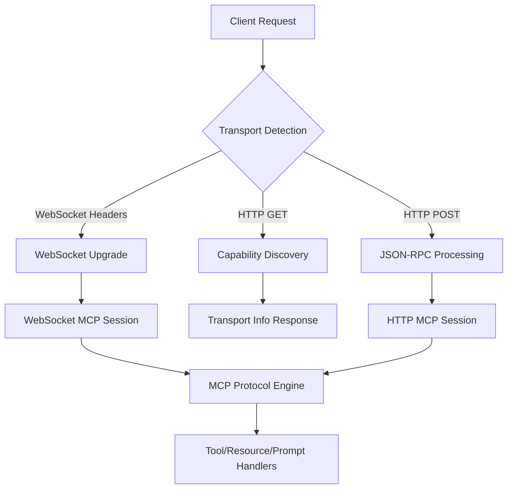

# SolidMCP Architecture Overview

## Current Architecture (Updated 2024)

SolidMCP has evolved into a comprehensive MCP server framework with intelligent transport handling and type-safe tool development. The architecture is built around several key principles:

### 1. Transport-Aware Design ✅ **IMPLEMENTED**

- **Smart Transport Detection**: Automatic capability negotiation based on HTTP headers
- **Multi-Transport Support**: WebSocket and HTTP JSON-RPC with seamless fallback
- **CORS-Enabled**: Full cross-origin support for web-based MCP clients
- **Future-Ready**: Architecture prepared for Server-Sent Events (SSE) streaming

### 2. Framework-Based Approach ✅ **IMPLEMENTED**

```rust
// Clean framework API with automatic schema generation
let server = McpServerBuilder::new(context, "server-name", "1.0.0")
    .with_tool("tool_name", "description", tool_handler)
    .with_resource_provider(Box::new(ResourceProvider))
    .with_prompt_provider(Box::new(PromptProvider))
    .build()
    .await?;
```

### 3. Type-Safe Tool Development ✅ **IMPLEMENTED**

- **Automatic JSON Schema**: `#[derive(JsonSchema)]` generates schemas at compile time
- **Type-Safe Handlers**: Input/output types checked at compile time
- **Error Handling**: Comprehensive error propagation and recovery

### 4. Modular Transport Layer ✅ **IMPLEMENTED**

Current transport architecture includes:

- **`transport.rs`**: Capability detection and negotiation
- **`http.rs`**: HTTP JSON-RPC with enhanced routing and CORS
- **`websocket.rs`**: WebSocket transport with upgrade detection
- **Enhanced Routing**: OPTIONS, GET (discovery), POST (JSON-RPC) with transport negotiation

## Current Priorities & Future Work

### 🔮 **Short-Term Goals**

#### 1. Server-Sent Events (SSE) Implementation

**Status**: Architecture complete, implementation planned

```rust
// TODO: Enable SSE when implementation is ready
let supports_sse = accept.contains("text/event-stream"); // Currently disabled
```

**Benefits:**

- Real-time streaming responses for large results
- Better client experience for long-running operations
- Maintain connection efficiency

#### 2. Enhanced WebSocket Features

- Sub-protocol negotiation
- Custom WebSocket message types
- Advanced connection management

#### 3. Configuration System

```rust
// Planned: Structured configuration API
let config = McpConfig::new()
    .with_transport(TransportConfig::http().with_cors(true))
    .with_session(SessionConfig::persistent())
    .with_logging(LogLevel::Info);
```

### 🏗️ **Medium-Term Goals**

#### 1. Plugin System

- Custom transport implementations
- Middleware support
- Extension points for protocol enhancements

#### 2. Advanced Security

- Authentication middleware
- Authorization policies
- Consent flow management

#### 3. Performance Optimizations

- Connection pooling
- Message batching
- Async streaming for large resources

### 🌟 **Long-Term Vision**

#### 1. Protocol Extensions

- Custom MCP extensions
- Protocol versioning strategies
- Backward compatibility guarantees

#### 2. Client Features

While SolidMCP focuses on server-side implementation, planned client-side features include:

- Sampling request handling
- Root boundary inquiries
- Advanced completion capabilities

## Architecture Components

### Core Modules

```
src/
├── framework.rs       ✅ High-level builder API and server management
├── handler.rs         ✅ Core traits for tools, resources, and prompts
├── transport.rs       ✅ Smart transport detection and capability negotiation
├── http.rs           ✅ HTTP JSON-RPC with CORS and enhanced routing
├── websocket.rs      ✅ WebSocket transport with upgrade handling
├── protocol.rs       ✅ MCP protocol implementation and validation
├── shared.rs         ✅ Common protocol engine and message routing
└── core.rs           ✅ Server lifecycle and connection management
```

### Transport Flow



## Key Design Decisions

### ✅ **What Works Well**

1. **Transport Abstraction**: Clean separation allows easy addition of new transports
2. **Type Safety**: Compile-time schema generation prevents runtime errors
3. **Framework API**: Minimal boilerplate for common use cases
4. **Test Coverage**: 99+ tests ensure reliability across all features
5. **Dependency Management**: Latest stable versions with regular updates

### 🔄 **Areas for Improvement**

1. **SSE Implementation**: Complete the streaming transport layer
2. **Configuration**: Move from environment variables to structured config
3. **Documentation**: Expand architectural documentation and examples
4. **Performance**: Add benchmarks and optimize high-load scenarios

## Success Metrics

### ✅ **Achieved**

- **Protocol Compliance**: Full MCP 2025-03-26 and 2025-06-18 support
- **Transport Reliability**: WebSocket and HTTP work with all major MCP clients
- **Developer Experience**: Minimal boilerplate, maximum type safety
- **Test Coverage**: Comprehensive test suite with real-world scenarios
- **Dependency Health**: Latest stable versions with security updates

### 🎯 **Targets**

- **SSE Support**: Complete streaming implementation for real-time updates
- **Performance**: Sub-10ms response times for typical tool calls
- **Documentation**: Complete API documentation with examples
- **Ecosystem**: Integration with popular Rust web frameworks

## Migration Notes

### Recent Changes (2024)

- ✅ **Transport Layer**: Added intelligent capability detection
- ✅ **Dependency Updates**: Updated to latest stable versions (Tokio 1.43, etc.)
- ✅ **CORS Support**: Full cross-origin handling for web clients
- ✅ **Enhanced HTTP**: OPTIONS, GET, POST with transport negotiation
- ✅ **Test Expansion**: 99+ tests covering all functionality

### Breaking Changes

- None - backward compatibility maintained

### Deprecations

- SSE capability detection temporarily disabled until implementation complete

This architecture prioritizes **server-side excellence** while maintaining **client compatibility**, with a clear path toward **streaming capabilities** and **advanced features**.
