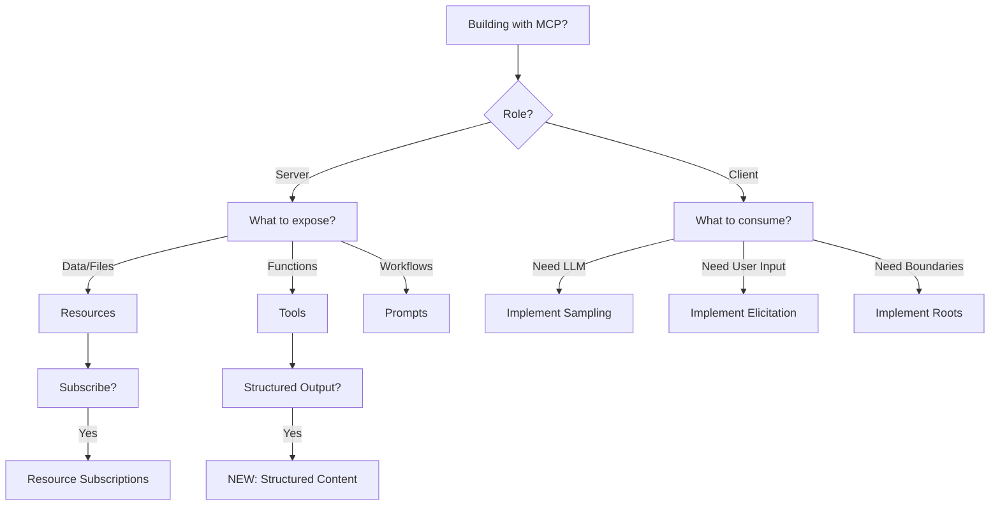

# MCP 2025-06-18 Protocol Reference

> **Model Context Protocol** - LLM-optimized implementation reference for version 2025-06-18

## Quick Start

MCP enables seamless integration between LLM applications and external data sources/tools through:
- **JSON-RPC 2.0** message format over WebSocket/HTTP transports
- **Stateful sessions** with capability negotiation
- **Three-tier architecture**: Host → Client → Server

## Feature Matrix

| Feature | Server → Client | Client → Server | NEW in 2025-06-18 |
|---------|----------------|-----------------|-------------------|
| **Tools** | ✓ Function execution | - | Structured output, Resource links |
| **Resources** | ✓ Data/context sharing | - | - |
| **Prompts** | ✓ Template workflows | - | - |
| **Sampling** | - | ✓ LLM interactions | - |
| **Elicitation** | - | ✓ User input requests | ✓ NEW |
| **Roots** | - | ✓ Boundary discovery | - |

## Navigation Guide

### 📦 [Core Protocol](./core/)
Foundation concepts for all implementations
- [Types](./core/types.md) - TypeScript interfaces & schemas
- [Messages](./core/messages.md) - JSON-RPC format & patterns
- [Lifecycle](./core/lifecycle.md) - Connection states & negotiation
- [Errors](./core/errors.md) - Error codes & handling

### 🔌 [Transport Layer](./transport/)
Connection mechanisms
- [WebSocket](./transport/websocket.md) - Real-time bidirectional
- [HTTP](./transport/http.md) - Request/response with sessions
- [Headers](./transport/headers.md) - Protocol headers (**NEW**: MCP-Protocol-Version)

### 🛠️ [Server Features](./server/)
Capabilities servers provide to clients
- [Tools](./server/tools/) - Function execution (**NEW**: structured output, resource links)
- [Resources](./server/resources/) - Data exposure & subscriptions
- [Prompts](./server/prompts/) - Template-based workflows

### 👤 [Client Features](./client/)
Capabilities clients provide to servers
- [Sampling](./client/sampling/) - LLM interaction requests
- [Elicitation](./client/elicitation/) - User input requests (**NEW**)
- [Roots](./client/roots/) - Boundary discovery

### 🔒 [Security](./security/)
Authorization and safety
- [OAuth](./security/oauth.md) - Resource Server classification (**NEW**)
- [RFC 8707](./security/rfc8707.md) - Resource Indicators (**NEW**)
- [Best Practices](./security/best-practices.md) - Implementation guidelines

### ⚙️ [Utilities](./utilities/)
Supporting protocol features
- [Progress](./utilities/progress.md) - Operation tracking
- [Cancellation](./utilities/cancellation.md) - Request cancellation
- [Logging](./utilities/logging.md) - Debug/diagnostic logs
- [Completion](./utilities/completion.md) - Autocomplete support
- [Pagination](./utilities/pagination.md) - Large result sets

### 📚 [Reference](./reference/)
Quick lookup materials
- [Schemas](./reference/schemas/) - Complete type definitions
- [Error Codes](./reference/error-codes.md) - All error codes
- [Capabilities](./reference/capability-matrix.md) - Feature flags
- [Message Catalog](./reference/message-catalog.md) - All message types
- [Diagrams](./reference/diagrams/) - Visual protocol flows

### 🚀 [Implementation](./implementation/)
Getting started guides
- [Quick Start](./implementation/quick-start.md) - Minimal setup
- [Examples](./implementation/examples/) - Code samples
- [Migration Guide](./implementation/migration-guide.md) - From 2025-03-26
- [Changelog](./implementation/changelog.md) - Detailed changes

## Decision Tree

## Key Changes in 2025-06-18

### Breaking Changes
- ❌ **Removed**: JSON-RPC batch support
- ⚠️ **Required**: MCP-Protocol-Version header for HTTP transport
- ⚠️ **Changed**: Lifecycle operation from SHOULD to MUST

### New Features
- ✅ **Elicitation**: Server-initiated user input requests
- ✅ **Structured Output**: Tools can return typed content
- ✅ **Resource Links**: Tools can reference resources
- ✅ **OAuth Resource Server**: MCP servers as OAuth resources
- ✅ **RFC 8707**: Resource Indicators for token security
- ✅ **Context in Completion**: Previous completions for better suggestions

### Enhanced Features
- 📝 Added `title` field for human-friendly display names
- 📝 Added `_meta` field to more interfaces
- 🔒 Clarified security considerations and best practices

## Implementation Checklist

- [ ] Choose transport: WebSocket (real-time) or HTTP (stateless)
- [ ] Implement core lifecycle: initialize → capabilities → operate → shutdown
- [ ] Handle errors with proper JSON-RPC error codes
- [ ] For servers:
  - [ ] Declare capabilities in initialization response
  - [ ] Implement at least one feature (tools/resources/prompts)
  - [ ] Handle subscriptions if using resources
- [ ] For clients:
  - [ ] Negotiate capabilities during initialization
  - [ ] Implement user consent for tools/sampling
  - [ ] Handle notifications and progress updates
- [ ] Security:
  - [ ] Implement proper authorization
  - [ ] Follow security best practices
  - [ ] Use RFC 8707 resource indicators for OAuth

## Protocol Version

This documentation covers **MCP version 2025-06-18**.

Schema source: [schema.ts](https://github.com/modelcontextprotocol/specification/blob/main/schema/2025-06-18/schema.ts)