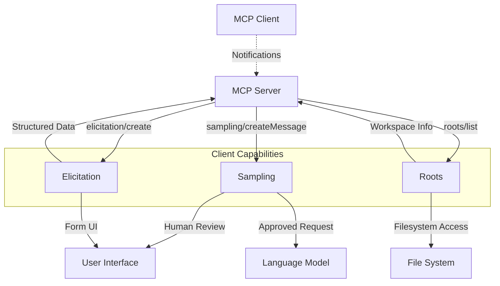
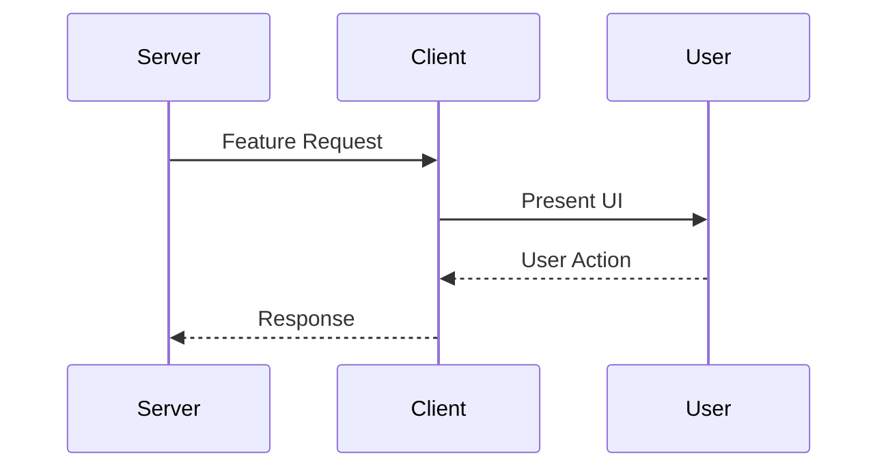
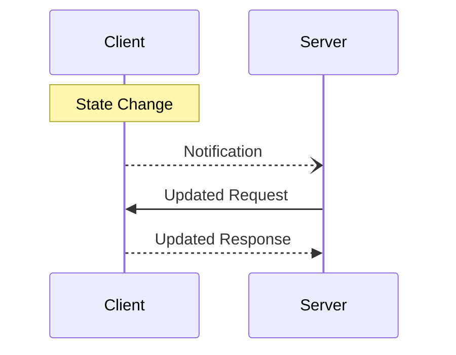

# MCP Client Features Overview

**Protocol Revision**: 2025-06-18

This directory contains comprehensive documentation for Model Context Protocol (MCP) client-side features that enable advanced server-client interactions.

## Core Client Features

### 🔄 [Sampling](sampling/)
- **Purpose**: Allows servers to request LLM sampling from clients
- **Use Case**: Agentic behaviors where servers need AI capabilities
- **Key Benefit**: Servers don't need API keys; clients maintain control
- **Security**: Human-in-the-loop validation required

### 🆕 [Elicitation](elicitation/) 
- **Purpose**: Enables servers to request structured user input
- **Use Case**: Interactive workflows requiring user data
- **Key Benefit**: Type-safe data collection with JSON Schema validation
- **Security**: Privacy-focused with explicit user consent

### 📁 [Roots](roots/)
- **Purpose**: Exposes filesystem boundaries to servers
- **Use Case**: Workspace/project-aware server operations
- **Key Benefit**: Controlled filesystem access with clear boundaries
- **Security**: Permission-based access controls

## Architecture Overview



## Capability Declaration

Clients must declare supported capabilities during initialization:

```json
{
  "capabilities": {
    "sampling": {},
    "elicitation": {},
    "roots": {
      "listChanged": true
    }
  }
}
```

## Message Flow Patterns

### 1. Server-Initiated Requests


### 2. Client-Driven Notifications


## Security Principles

### Human-in-the-Loop
- **Sampling**: User must approve LLM requests and responses
- **Elicitation**: User provides explicit consent for data sharing
- **Roots**: User controls filesystem access boundaries

### Privacy Protection
- Clients maintain control over sensitive operations
- Users can review, modify, or reject all requests
- Clear indication of which server is requesting what

### Access Controls
- **Sampling**: Rate limiting and model selection controls
- **Elicitation**: Schema validation and data sanitization
- **Roots**: Path validation and permission enforcement

## Implementation Guidelines

### Client Requirements
1. **UI/UX**: Provide clear, intuitive interfaces for user interaction
2. **Validation**: Implement proper input validation and sanitization
3. **Security**: Enforce access controls and user consent mechanisms
4. **Error Handling**: Gracefully handle failures and edge cases

### Server Requirements
1. **Respect Boundaries**: Honor client capabilities and user decisions
2. **Error Resilience**: Handle rejected requests gracefully
3. **Documentation**: Clearly document feature usage and requirements
4. **Testing**: Thoroughly test interactions with various client implementations

## Common Patterns

### Feature Detection
```typescript
// Check client capabilities
if (clientCapabilities.sampling) {
  // Use sampling features
}

if (clientCapabilities.elicitation) {
  // Use elicitation features
}

if (clientCapabilities.roots?.listChanged) {
  // Subscribe to roots changes
}
```

### Error Handling
```typescript
try {
  const result = await client.request('sampling/createMessage', params);
} catch (error) {
  if (error.code === -1) {
    // User rejected request
    console.log('User declined sampling request');
  }
  // Handle other errors
}
```

### Graceful Degradation
```typescript
// Fallback strategies when features unavailable
if (!clientCapabilities.sampling) {
  // Use alternative approach or inform user
  return "LLM sampling not available in this client";
}
```

## Protocol Evolution

### Version Compatibility
- Features introduced in 2025-06-18 protocol revision
- Elicitation is newly introduced and may evolve
- Backward compatibility maintained for core features

### Future Considerations
- Enhanced schema support for elicitation
- Additional root URI schemes beyond `file://`
- Extended sampling capabilities and model preferences

## Related Documentation

- [Core Protocol](../core/) - Basic MCP protocol foundations
- [Server Features](../server/) - Server-side capabilities
- [Transport Layer](../transport/) - Communication mechanisms
- [Security Guidelines](../security/) - Comprehensive security practices

---

**Note**: All client features require explicit capability declaration and maintain strict security boundaries with human oversight.