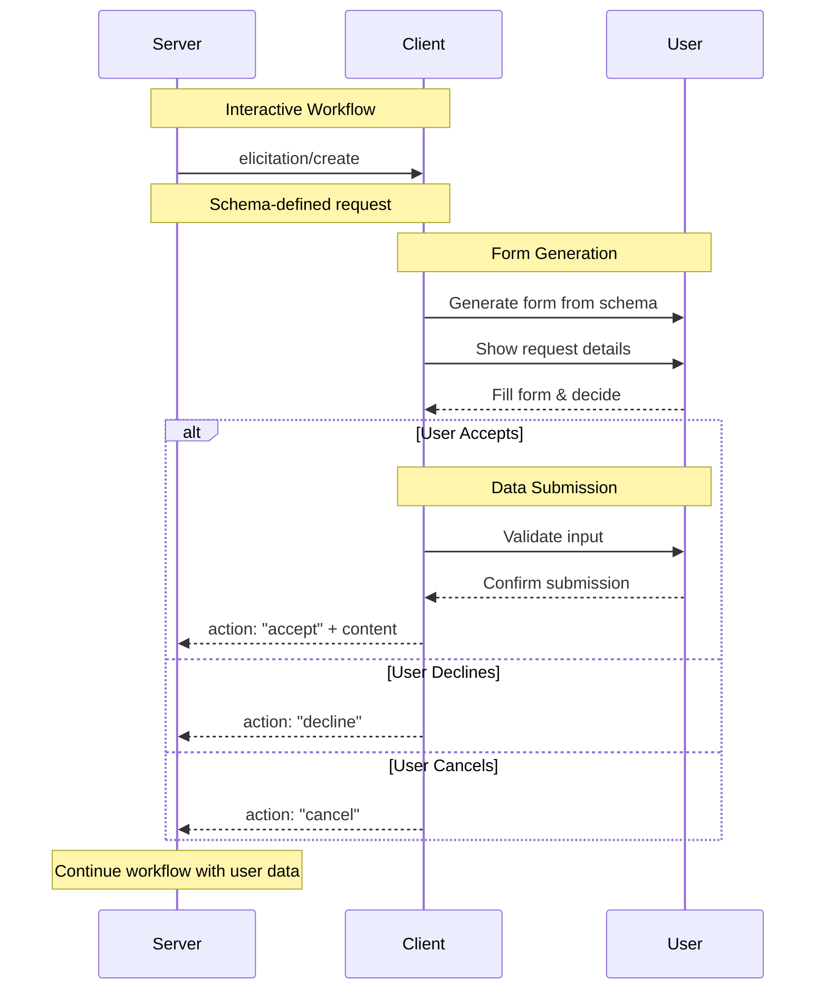

# Elicitation Overview

**Protocol Revision**: 2025-06-18  
**🆕 NEW FEATURE** - Introduced in this protocol version

Elicitation enables MCP servers to request structured user input through clients, allowing interactive workflows while maintaining user privacy and control over data sharing.

## Core Concepts

### Interactive Data Collection
- Servers request specific information from users via structured forms
- JSON Schema validation ensures type safety and data integrity
- Users maintain full control over what information to share

### Three-Action Response Model
- **Accept**: User explicitly provides requested data
- **Decline**: User explicitly refuses to provide data  
- **Cancel**: User dismisses without making a choice

### Privacy-First Design
- Servers cannot access sensitive information without explicit consent
- Users can review and modify responses before submission
- Clear indication of requesting server and data purpose

## Quick Start

### 1. Capability Declaration
```json
{
  "capabilities": {
    "elicitation": {}
  }
}
```

### 2. Basic Text Input Request
```json
{
  "jsonrpc": "2.0",
  "id": 1,
  "method": "elicitation/create",
  "params": {
    "message": "Please provide your GitHub username",
    "requestedSchema": {
      "type": "object",
      "properties": {
        "username": {
          "type": "string",
          "title": "GitHub Username",
          "description": "Your GitHub account username"
        }
      },
      "required": ["username"]
    }
  }
}
```

### 3. User Acceptance Response
```json
{
  "jsonrpc": "2.0",
  "id": 1,
  "result": {
    "action": "accept",
    "content": {
      "username": "octocat"
    }
  }
}
```

## Message Flow



## Schema System

### Simplified JSON Schema
Elicitation uses a restricted subset of JSON Schema for client implementation simplicity:

```typescript
interface ElicitationSchema {
  type: "object";
  properties: {
    [key: string]: PrimitiveSchemaDefinition;
  };
  required?: string[];
}

type PrimitiveSchemaDefinition = 
  | StringSchema 
  | NumberSchema 
  | BooleanSchema 
  | EnumSchema;
```

### Supported Property Types

#### String Properties
```json
{
  "username": {
    "type": "string",
    "title": "Username",
    "description": "Your account username",
    "minLength": 3,
    "maxLength": 20
  },
  "email": {
    "type": "string", 
    "format": "email",
    "title": "Email Address"
  }
}
```

#### Number Properties
```json
{
  "age": {
    "type": "integer",
    "title": "Age",
    "minimum": 18,
    "maximum": 120
  },
  "score": {
    "type": "number",
    "title": "Score",
    "minimum": 0.0,
    "maximum": 100.0
  }
}
```

#### Boolean Properties
```json
{
  "subscribe": {
    "type": "boolean",
    "title": "Subscribe to Newsletter",
    "description": "Receive project updates via email",
    "default": false
  }
}
```

#### Enum Properties
```json
{
  "priority": {
    "type": "string",
    "title": "Priority Level",
    "enum": ["low", "medium", "high"],
    "enumNames": ["Low Priority", "Medium Priority", "High Priority"]
  }
}
```

## Use Cases

### 1. Development Configuration
```json
{
  "message": "Configure your development environment",
  "requestedSchema": {
    "type": "object",
    "properties": {
      "editor": {
        "type": "string",
        "title": "Preferred Editor",
        "enum": ["vscode", "vim", "emacs", "sublime"],
        "enumNames": ["VS Code", "Vim", "Emacs", "Sublime Text"]
      },
      "port": {
        "type": "integer",
        "title": "Development Port",
        "minimum": 1024,
        "maximum": 65535,
        "default": 3000
      },
      "enableHotReload": {
        "type": "boolean",
        "title": "Enable Hot Reload",
        "default": true
      }
    },
    "required": ["editor", "port"]
  }
}
```

### 2. Project Setup Wizard
```json
{
  "message": "Create a new project configuration",
  "requestedSchema": {
    "type": "object", 
    "properties": {
      "projectName": {
        "type": "string",
        "title": "Project Name",
        "minLength": 1,
        "maxLength": 50
      },
      "framework": {
        "type": "string",
        "title": "Framework",
        "enum": ["react", "vue", "angular", "svelte"],
        "enumNames": ["React", "Vue.js", "Angular", "Svelte"]
      },
      "typescript": {
        "type": "boolean",
        "title": "Use TypeScript",
        "default": true
      },
      "license": {
        "type": "string",
        "title": "License",
        "enum": ["mit", "apache", "gpl", "bsd"],
        "enumNames": ["MIT", "Apache 2.0", "GPL v3", "BSD 3-Clause"]
      }
    },
    "required": ["projectName", "framework"]
  }
}
```

### 3. User Preferences
```json
{
  "message": "Customize your workflow preferences",
  "requestedSchema": {
    "type": "object",
    "properties": {
      "notifications": {
        "type": "boolean",
        "title": "Enable Notifications",
        "description": "Receive desktop notifications for important events"
      },
      "theme": {
        "type": "string",
        "title": "Color Theme",
        "enum": ["light", "dark", "auto"],
        "enumNames": ["Light", "Dark", "Auto (system)"]
      },
      "maxFileSize": {
        "type": "number",
        "title": "Max File Size (MB)",
        "minimum": 1,
        "maximum": 100,
        "default": 10
      }
    }
  }
}
```

## Response Actions

### Accept Response
User provides requested data:
```json
{
  "action": "accept",
  "content": {
    "projectName": "my-awesome-app",
    "framework": "react",
    "typescript": true,
    "license": "mit"
  }
}
```

### Decline Response  
User explicitly refuses to provide data:
```json
{
  "action": "decline"
}
```

### Cancel Response
User dismisses without explicit choice:
```json
{
  "action": "cancel"
}
```

## Advanced Features

### Format Validation
```json
{
  "properties": {
    "email": {
      "type": "string",
      "format": "email",
      "title": "Email Address"
    },
    "website": {
      "type": "string", 
      "format": "uri",
      "title": "Website URL"
    },
    "birthDate": {
      "type": "string",
      "format": "date",
      "title": "Birth Date"
    },
    "appointment": {
      "type": "string",
      "format": "date-time", 
      "title": "Appointment Time"
    }
  }
}
```

### Length Constraints
```json
{
  "properties": {
    "password": {
      "type": "string",
      "title": "Password",
      "minLength": 8,
      "maxLength": 50,
      "description": "Must be 8-50 characters"
    },
    "description": {
      "type": "string",
      "title": "Description", 
      "maxLength": 500,
      "description": "Brief project description"
    }
  }
}
```

### Numeric Ranges
```json
{
  "properties": {
    "temperature": {
      "type": "number",
      "title": "Temperature (°C)",
      "minimum": -273.15,
      "maximum": 1000
    },
    "quantity": {
      "type": "integer",
      "title": "Quantity",
      "minimum": 1,
      "maximum": 99
    }
  }
}
```

## Error Handling

### Schema Validation Errors
```json
{
  "jsonrpc": "2.0",
  "id": 1,
  "error": {
    "code": -32602,
    "message": "Invalid schema",
    "data": {
      "field": "properties.age.type",
      "error": "Unsupported type 'array'",
      "supportedTypes": ["string", "number", "integer", "boolean"]
    }
  }
}
```

### Client Capability Errors
```json
{
  "error": {
    "code": -32601,
    "message": "Elicitation not supported",
    "data": {
      "reason": "Client does not have elicitation capability"
    }
  }
}
```

### User Interaction Errors
```json
{
  "error": {
    "code": -32000,
    "message": "Elicitation timeout",
    "data": {
      "reason": "User did not respond within timeout period",
      "timeoutSeconds": 300
    }
  }
}
```

## Implementation Patterns

### Server-Side Usage
```typescript
class InteractiveServer {
  async setupProject(): Promise<ProjectConfig> {
    try {
      const result = await this.client.request('elicitation/create', {
        message: "Configure your new project",
        requestedSchema: {
          type: "object",
          properties: {
            name: { 
              type: "string", 
              title: "Project Name",
              minLength: 1 
            },
            framework: {
              type: "string",
              title: "Framework",
              enum: ["react", "vue", "angular"],
              enumNames: ["React", "Vue.js", "Angular"]
            }
          },
          required: ["name", "framework"]
        }
      });
      
      if (result.action === "accept") {
        return this.createProject(result.content);
      } else if (result.action === "decline") {
        throw new Error("User declined project setup");
      } else {
        throw new Error("Project setup cancelled");
      }
    } catch (error) {
      return this.useDefaultConfig();
    }
  }
}
```

### Client-Side Implementation
```typescript
class ElicitationHandler {
  async handleElicitationRequest(request: ElicitRequest): Promise<ElicitResult> {
    // 1. Validate schema
    this.validateSchema(request.params.requestedSchema);
    
    // 2. Generate form UI
    const form = this.generateForm(request.params.requestedSchema);
    
    // 3. Present to user
    const userResponse = await this.showElicitationDialog({
      message: request.params.message,
      form,
      serverName: this.getServerName(),
      allowCancel: true
    });
    
    // 4. Validate user input
    if (userResponse.action === "accept") {
      const validationResult = this.validateUserInput(
        userResponse.content,
        request.params.requestedSchema
      );
      
      if (!validationResult.valid) {
        throw new Error(`Validation failed: ${validationResult.errors.join(', ')}`);
      }
    }
    
    return userResponse;
  }
}
```

## Best Practices

### For Servers
1. **Clear Messages**: Explain why information is needed
2. **Minimal Requests**: Only ask for necessary information  
3. **Graceful Handling**: Handle all response actions appropriately
4. **User-Friendly Schemas**: Use descriptive titles and help text
5. **Reasonable Defaults**: Provide sensible default values

### For Clients
1. **Intuitive Forms**: Generate user-friendly input forms
2. **Clear Identification**: Show which server is requesting data
3. **Validation**: Validate input against schema before submission
4. **Privacy Protection**: Allow users to review before sharing
5. **Accessibility**: Ensure forms are accessible to all users

### Security Considerations
1. **No Sensitive Data**: Never request passwords, API keys, etc.
2. **Input Sanitization**: Validate and sanitize all user input
3. **Server Identification**: Clearly show which server is requesting data
4. **User Control**: Always allow decline/cancel options
5. **Audit Logging**: Log elicitation requests for security review

## Related Documentation

- [Elicitation Types](types.md) - Detailed schema type reference
- [UI Requirements](ui-requirements.md) - Client implementation guidelines  
- [Sampling](../sampling/) - AI model interaction features
- [Core Protocol](../../core/) - MCP protocol foundations

---

**Note**: Elicitation is a new feature in the 2025-06-18 protocol revision and its design may evolve in future versions based on implementation feedback.