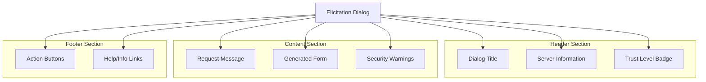

# Elicitation UI Requirements

**Protocol Revision**: 2025-06-18  
**🆕 NEW FEATURE** - Client implementation guidelines for user interaction

Comprehensive guidelines for implementing elicitation user interfaces that prioritize security, usability, and accessibility while maintaining user control over data sharing.

## Core UI Principles

### User Control and Transparency
- **Clear Server Identity**: Always show which server is requesting information
- **Explicit Consent**: Users must explicitly approve data sharing
- **Review Before Submission**: Allow users to review and modify responses
- **Easy Decline/Cancel**: Provide obvious options to refuse or dismiss

### Security First
- **Trust Indicators**: Show server trust levels and security status
- **Data Sensitivity Warnings**: Highlight potentially sensitive information
- **Secure Input**: Use appropriate input types and validation
- **Audit Trail**: Log user decisions for security review

### Accessibility and Usability
- **Intuitive Forms**: Generate user-friendly forms from schemas
- **Clear Validation**: Provide immediate, helpful feedback
- **Keyboard Navigation**: Support full keyboard accessibility
- **Screen Reader Support**: Implement proper ARIA attributes

## UI Components

### Elicitation Dialog Structure


### Required UI Elements

#### Server Identification
```typescript
interface ServerIdentification {
  name: string;
  trustLevel: "trusted" | "untrusted" | "unknown";
  icon?: string;
  description?: string;
  verificationStatus: "verified" | "unverified";
}

// Example UI display
function renderServerInfo(server: ServerIdentification): JSX.Element {
  return (
    <div className="server-info">
      <div className="server-header">
        
        <h3>{server.name}</h3>
        <TrustBadge level={server.trustLevel} />
      </div>
      <p className="server-description">{server.description}</p>
      {server.verificationStatus === "unverified" && (
        <Warning>This server is not verified. Use caution when sharing information.</Warning>
      )}
    </div>
  );
}
```

#### Trust Level Indicators
```css
.trust-badge {
  padding: 4px 8px;
  border-radius: 4px;
  font-size: 12px;
  font-weight: bold;
  text-transform: uppercase;
}

.trust-badge.trusted {
  background-color: #22c55e;
  color: white;
}

.trust-badge.untrusted {
  background-color: #ef4444;
  color: white;
}

.trust-badge.unknown {
  background-color: #f59e0b;
  color: white;
}
```

#### Action Buttons
```typescript
interface ElicitationActions {
  onAccept: (data: Record<string, any>) => void;
  onDecline: () => void;
  onCancel: () => void;
  onReview: () => void;
}

function renderActions(actions: ElicitationActions, formValid: boolean): JSX.Element {
  return (
    <div className="elicitation-actions">
      <button 
        type="button" 
        onClick={actions.onCancel}
        className="btn-secondary"
      >
        Cancel
      </button>
      
      <button 
        type="button" 
        onClick={actions.onDecline}
        className="btn-danger"
      >
        Decline
      </button>
      
      <button 
        type="button" 
        onClick={actions.onReview}
        className="btn-info"
        disabled={!formValid}
      >
        Review
      </button>
      
      <button 
        type="submit" 
        onClick={actions.onAccept}
        className="btn-primary"
        disabled={!formValid}
      >
        Accept & Share
      </button>
    </div>
  );
}
```

## Form Generation

### Dynamic Form Creation
```typescript
interface FormGenerator {
  generateForm(schema: ElicitationSchema): FormDefinition;
  renderField(field: FormField): JSX.Element;
  validateForm(data: Record<string, any>): ValidationResult;
}

class ElicitationFormGenerator implements FormGenerator {
  generateForm(schema: ElicitationSchema): FormDefinition {
    const fields: FormField[] = [];
    
    for (const [name, propSchema] of Object.entries(schema.properties)) {
      const field = this.createFormField(
        name, 
        propSchema, 
        schema.required?.includes(name) || false
      );
      fields.push(field);
    }
    
    return {
      fields,
      validation: this.createValidationRules(schema)
    };
  }
  
  private createFormField(
    name: string, 
    schema: PrimitiveSchemaDefinition, 
    required: boolean
  ): FormField {
    switch (schema.type) {
      case "string":
        return this.createStringField(name, schema as StringSchema, required);
      case "number":
      case "integer":
        return this.createNumberField(name, schema as NumberSchema, required);
      case "boolean":
        return this.createBooleanField(name, schema as BooleanSchema, required);
      default:
        throw new Error(`Unsupported field type: ${schema.type}`);
    }
  }
}
```

### Input Field Types

#### Text Input Fields
```typescript
function renderTextInput(field: StringFormField): JSX.Element {
  const inputType = field.format === "email" ? "email" 
                  : field.format === "uri" ? "url"
                  : field.format === "date" ? "date"
                  : field.format === "date-time" ? "datetime-local"
                  : "text";
  
  return (
    <div className="form-field">
      <label htmlFor={field.name} className={field.required ? "required" : ""}>
        {field.label}
        {field.required && <span className="required-indicator">*</span>}
      </label>
      
      {field.description && (
        <p className="field-description">{field.description}</p>
      )}
      
      <input
        type={inputType}
        id={field.name}
        name={field.name}
        value={field.value}
        onChange={field.onChange}
        onBlur={field.onBlur}
        required={field.required}
        minLength={field.minLength}
        maxLength={field.maxLength}
        placeholder={field.placeholder}
        aria-describedby={`${field.name}-help ${field.name}-error`}
        className={field.error ? "error" : ""}
      />
      
      {field.error && (
        <div id={`${field.name}-error`} className="field-error" role="alert">
          {field.error}
        </div>
      )}
      
      {field.helpText && (
        <div id={`${field.name}-help`} className="field-help">
          {field.helpText}
        </div>
      )}
    </div>
  );
}
```

#### Number Input Fields
```typescript
function renderNumberInput(field: NumberFormField): JSX.Element {
  return (
    <div className="form-field">
      <label htmlFor={field.name} className={field.required ? "required" : ""}>
        {field.label}
        {field.required && <span className="required-indicator">*</span>}
      </label>
      
      {field.description && (
        <p className="field-description">{field.description}</p>
      )}
      
      <input
        type="number"
        id={field.name}
        name={field.name}
        value={field.value}
        onChange={field.onChange}
        onBlur={field.onBlur}
        required={field.required}
        min={field.minimum}
        max={field.maximum}
        step={field.type === "integer" ? 1 : 0.01}
        placeholder={field.placeholder}
        aria-describedby={`${field.name}-help ${field.name}-error`}
        className={field.error ? "error" : ""}
      />
      
      {(field.minimum !== undefined || field.maximum !== undefined) && (
        <div className="field-constraints">
          {field.minimum !== undefined && field.maximum !== undefined 
            ? `Range: ${field.minimum} - ${field.maximum}`
            : field.minimum !== undefined 
            ? `Minimum: ${field.minimum}`
            : `Maximum: ${field.maximum}`
          }
        </div>
      )}
      
      {field.error && (
        <div id={`${field.name}-error`} className="field-error" role="alert">
          {field.error}
        </div>
      )}
    </div>
  );
}
```

#### Boolean Input Fields
```typescript
function renderBooleanInput(field: BooleanFormField): JSX.Element {
  return (
    <div className="form-field form-field-checkbox">
      <div className="checkbox-wrapper">
        <input
          type="checkbox"
          id={field.name}
          name={field.name}
          checked={field.value}
          onChange={field.onChange}
          aria-describedby={`${field.name}-help`}
        />
        
        <label htmlFor={field.name}>
          {field.label}
        </label>
      </div>
      
      {field.description && (
        <p id={`${field.name}-help`} className="field-description">
          {field.description}
        </p>
      )}
    </div>
  );
}
```

#### Enum/Select Fields
```typescript
function renderSelectInput(field: EnumFormField): JSX.Element {
  return (
    <div className="form-field">
      <label htmlFor={field.name} className={field.required ? "required" : ""}>
        {field.label}
        {field.required && <span className="required-indicator">*</span>}
      </label>
      
      {field.description && (
        <p className="field-description">{field.description}</p>
      )}
      
      <select
        id={field.name}
        name={field.name}
        value={field.value}
        onChange={field.onChange}
        required={field.required}
        aria-describedby={`${field.name}-help ${field.name}-error`}
        className={field.error ? "error" : ""}
      >
        <option value="">Select an option...</option>
        {field.options.map((option) => (
          <option key={option.value} value={option.value}>
            {option.label}
          </option>
        ))}
      </select>
      
      {field.error && (
        <div id={`${field.name}-error`} className="field-error" role="alert">
          {field.error}
        </div>
      )}
    </div>
  );
}
```

## Real-Time Validation

### Immediate Feedback
```typescript
interface FieldValidator {
  validateField(value: any, schema: PrimitiveSchemaDefinition): ValidationResult;
  validateForm(data: Record<string, any>, schema: ElicitationSchema): FormValidationResult;
}

class RealtimeValidator implements FieldValidator {
  validateField(value: any, schema: PrimitiveSchemaDefinition): ValidationResult {
    // Early return for empty optional fields
    if ((value === "" || value === undefined) && !this.isRequired(schema)) {
      return { valid: true };
    }
    
    switch (schema.type) {
      case "string":
        return this.validateStringField(value, schema as StringSchema);
      case "number":
      case "integer":
        return this.validateNumberField(value, schema as NumberSchema);
      case "boolean":
        return this.validateBooleanField(value, schema as BooleanSchema);
      default:
        return { valid: false, error: `Unsupported type: ${schema.type}` };
    }
  }
  
  private validateStringField(value: string, schema: StringSchema): ValidationResult {
    if (schema.minLength && value.length < schema.minLength) {
      return { 
        valid: false, 
        error: `Must be at least ${schema.minLength} characters` 
      };
    }
    
    if (schema.maxLength && value.length > schema.maxLength) {
      return { 
        valid: false, 
        error: `Must be no more than ${schema.maxLength} characters` 
      };
    }
    
    if (schema.format) {
      return this.validateFormat(value, schema.format);
    }
    
    if (schema.enum && !schema.enum.includes(value)) {
      return { 
        valid: false, 
        error: `Must be one of: ${schema.enum.join(", ")}` 
      };
    }
    
    return { valid: true };
  }
}
```

### Visual Validation States
```css
.form-field input.valid {
  border-color: #22c55e;
  box-shadow: 0 0 0 2px rgba(34, 197, 94, 0.1);
}

.form-field input.error {
  border-color: #ef4444;
  box-shadow: 0 0 0 2px rgba(239, 68, 68, 0.1);
}

.field-error {
  color: #ef4444;
  font-size: 14px;
  margin-top: 4px;
  display: flex;
  align-items: center;
  gap: 4px;
}

.field-error::before {
  content: "⚠";
  font-size: 16px;
}

.field-help {
  color: #6b7280;
  font-size: 14px;
  margin-top: 4px;
}

.required-indicator {
  color: #ef4444;
  margin-left: 2px;
}
```

## Security UI Elements

### Data Sensitivity Warnings
```typescript
interface SecurityWarning {
  level: "info" | "warning" | "danger";
  message: string;
  details?: string;
}

function renderSecurityWarnings(warnings: SecurityWarning[]): JSX.Element {
  if (warnings.length === 0) return null;
  
  return (
    <div className="security-warnings">
      <h4>Security Notice</h4>
      {warnings.map((warning, index) => (
        <div key={index} className={`security-warning ${warning.level}`}>
          <div className="warning-icon">
            {warning.level === "danger" ? "🚨" 
             : warning.level === "warning" ? "⚠️" 
             : "ℹ️"}
          </div>
          <div className="warning-content">
            <p className="warning-message">{warning.message}</p>
            {warning.details && (
              <p className="warning-details">{warning.details}</p>
            )}
          </div>
        </div>
      ))}
    </div>
  );
}
```

### Privacy Controls
```typescript
interface PrivacyControls {
  allowDataRetention: boolean;
  allowDataSharing: boolean;
  requestPurpose: string;
  dataUsagePolicy?: string;
}

function renderPrivacyControls(controls: PrivacyControls): JSX.Element {
  return (
    <div className="privacy-controls">
      <h4>Privacy Settings</h4>
      
      <div className="privacy-info">
        <label>Purpose:</label>
        <span>{controls.requestPurpose}</span>
      </div>
      
      {controls.dataUsagePolicy && (
        <div className="privacy-info">
          <label>Data Usage:</label>
          <span>{controls.dataUsagePolicy}</span>
        </div>
      )}
      
      <div className="privacy-options">
        <label>
          <input 
            type="checkbox" 
            checked={controls.allowDataRetention}
            disabled
          />
          Server may temporarily store this data
        </label>
        
        <label>
          <input 
            type="checkbox" 
            checked={controls.allowDataSharing}
            disabled
          />
          Data may be shared with third-party services
        </label>
      </div>
    </div>
  );
}
```

## Accessibility Implementation

### ARIA Attributes
```typescript
function renderAccessibleForm(form: FormDefinition): JSX.Element {
  return (
    <form 
      role="form"
      aria-labelledby="elicitation-title"
      aria-describedby="elicitation-description"
      onSubmit={handleSubmit}
    >
      <fieldset>
        <legend id="elicitation-title">Information Request</legend>
        <p id="elicitation-description">
          Please provide the following information to continue.
        </p>
        
        {form.fields.map((field) => (
          <div key={field.name} className="form-field" role="group">
            {renderField(field)}
          </div>
        ))}
      </fieldset>
      
      <div role="group" aria-label="Actions">
        {renderActions()}
      </div>
    </form>
  );
}
```

### Keyboard Navigation
```typescript
class ElicitationDialog {
  private setupKeyboardNavigation(): void {
    this.dialog.addEventListener("keydown", (event) => {
      switch (event.key) {
        case "Escape":
          this.handleCancel();
          break;
          
        case "Enter":
          if (event.ctrlKey || event.metaKey) {
            this.handleAccept();
          }
          break;
          
        case "Tab":
          this.handleTabNavigation(event);
          break;
      }
    });
  }
  
  private handleTabNavigation(event: KeyboardEvent): void {
    const focusableElements = this.dialog.querySelectorAll(
      'input, select, textarea, button, [tabindex]:not([tabindex="-1"])'
    );
    
    const firstElement = focusableElements[0] as HTMLElement;
    const lastElement = focusableElements[focusableElements.length - 1] as HTMLElement;
    
    if (event.shiftKey && document.activeElement === firstElement) {
      event.preventDefault();
      lastElement.focus();
    } else if (!event.shiftKey && document.activeElement === lastElement) {
      event.preventDefault();
      firstElement.focus();
    }
  }
}
```

### Screen Reader Support
```typescript
function announceValidationErrors(errors: ValidationError[]): void {
  const errorSummary = errors.map(error => 
    `${error.field}: ${error.message}`
  ).join(". ");
  
  const announcement = `${errors.length} validation error${errors.length > 1 ? 's' : ''}. ${errorSummary}`;
  
  // Create or update live region
  let liveRegion = document.getElementById("validation-announcements");
  if (!liveRegion) {
    liveRegion = document.createElement("div");
    liveRegion.id = "validation-announcements";
    liveRegion.setAttribute("aria-live", "polite");
    liveRegion.setAttribute("aria-atomic", "true");
    liveRegion.style.position = "absolute";
    liveRegion.style.left = "-10000px";
    document.body.appendChild(liveRegion);
  }
  
  liveRegion.textContent = announcement;
}
```

## Dialog Management

### Modal Dialog Implementation
```typescript
class ElicitationModal {
  private dialog: HTMLElement;
  private backdrop: HTMLElement;
  private previousFocus: HTMLElement | null = null;
  
  show(): void {
    // Store current focus
    this.previousFocus = document.activeElement as HTMLElement;
    
    // Show dialog
    this.dialog.style.display = "block";
    this.backdrop.style.display = "block";
    
    // Trap focus
    this.trapFocus();
    
    // Focus first interactive element
    const firstInput = this.dialog.querySelector("input, select, textarea, button") as HTMLElement;
    firstInput?.focus();
    
    // Prevent body scroll
    document.body.style.overflow = "hidden";
  }
  
  hide(): void {
    // Hide dialog
    this.dialog.style.display = "none";
    this.backdrop.style.display = "none";
    
    // Restore focus
    this.previousFocus?.focus();
    
    // Restore body scroll
    document.body.style.overflow = "";
  }
  
  private trapFocus(): void {
    const focusableElements = this.dialog.querySelectorAll(
      'input, select, textarea, button, [href], [tabindex]:not([tabindex="-1"])'
    );
    
    if (focusableElements.length === 0) return;
    
    const firstElement = focusableElements[0] as HTMLElement;
    const lastElement = focusableElements[focusableElements.length - 1] as HTMLElement;
    
    this.dialog.addEventListener("keydown", (event) => {
      if (event.key === "Tab") {
        if (event.shiftKey) {
          if (document.activeElement === firstElement) {
            event.preventDefault();
            lastElement.focus();
          }
        } else {
          if (document.activeElement === lastElement) {
            event.preventDefault();
            firstElement.focus();
          }
        }
      }
    });
  }
}
```

## Progressive Enhancement

### Basic HTML Form
```html
<!-- Fallback for non-JavaScript environments -->
<form method="post" action="/elicitation/submit">
  <fieldset>
    <legend>Information Request</legend>
    
    <div class="form-field">
      <label for="username">Username (required)</label>
      <input type="text" id="username" name="username" required minlength="3" maxlength="20">
    </div>
    
    <div class="form-field">
      <label for="email">Email Address (required)</label>
      <input type="email" id="email" name="email" required>
    </div>
    
    <div class="form-actions">
      <button type="button" name="action" value="cancel">Cancel</button>
      <button type="button" name="action" value="decline">Decline</button>
      <button type="submit" name="action" value="accept">Accept</button>
    </div>
  </fieldset>
</form>
```

### JavaScript Enhancement
```typescript
class ProgressiveElicitation {
  enhance(form: HTMLFormElement): void {
    // Add real-time validation
    this.addRealtimeValidation(form);
    
    // Add AJAX submission
    this.addAjaxSubmission(form);
    
    // Add enhanced accessibility
    this.addAccessibilityEnhancements(form);
    
    // Add visual improvements
    this.addVisualEnhancements(form);
  }
  
  private addRealtimeValidation(form: HTMLFormElement): void {
    form.addEventListener("input", (event) => {
      const field = event.target as HTMLInputElement;
      this.validateField(field);
    });
    
    form.addEventListener("blur", (event) => {
      const field = event.target as HTMLInputElement;
      this.validateField(field);
    }, true);
  }
}
```

## Testing Requirements

### Unit Tests
```typescript
describe("ElicitationUI", () => {
  it("should generate form from schema", () => {
    const schema: ElicitationSchema = {
      type: "object",
      properties: {
        username: { type: "string", title: "Username" }
      }
    };
    
    const form = generator.generateForm(schema);
    expect(form.fields).toHaveLength(1);
    expect(form.fields[0].name).toBe("username");
  });
  
  it("should validate required fields", () => {
    const result = validator.validateForm(
      { username: "" },
      { type: "object", properties: { username: { type: "string" }}, required: ["username"] }
    );
    
    expect(result.valid).toBe(false);
    expect(result.errors).toContain("username is required");
  });
});
```

### Accessibility Tests
```typescript
describe("Accessibility", () => {
  it("should have proper ARIA labels", () => {
    const form = renderElicitationForm(schema);
    const inputs = form.querySelectorAll("input");
    
    inputs.forEach(input => {
      expect(input.getAttribute("aria-labelledby")).toBeTruthy();
    });
  });
  
  it("should support keyboard navigation", () => {
    const dialog = new ElicitationModal();
    dialog.show();
    
    // Test tab navigation
    const tabEvent = new KeyboardEvent("keydown", { key: "Tab" });
    dialog.handleKeydown(tabEvent);
    
    // Verify focus management
    expect(document.activeElement).toBeTruthy();
  });
});
```

## Best Practices Summary

### Do's
- ✅ Always show server identity and trust level
- ✅ Provide clear validation feedback
- ✅ Support keyboard navigation
- ✅ Use semantic HTML elements
- ✅ Implement proper focus management
- ✅ Allow users to review before submission
- ✅ Provide obvious decline/cancel options

### Don'ts
- ❌ Never auto-submit without user approval
- ❌ Don't hide server identity
- ❌ Don't ignore accessibility requirements
- ❌ Don't make forms overly complex
- ❌ Don't submit sensitive data without warnings
- ❌ Don't trap users without escape options
- ❌ Don't skip validation feedback

## Related Documentation

- [Elicitation Overview](README.md) - High-level elicitation concepts
- [Elicitation Types](types.md) - Schema type reference
- [Sampling Security](../sampling/security.md) - Security best practices
- [Core Protocol](../../core/) - MCP protocol foundations