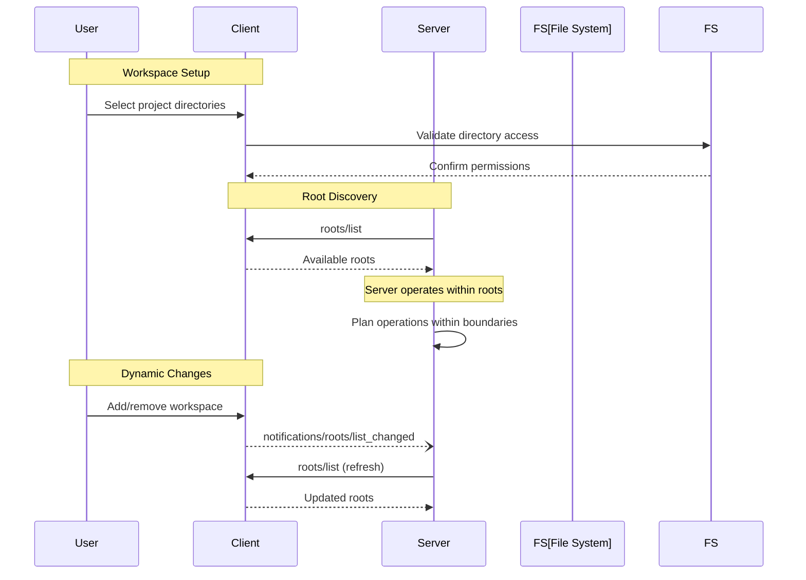

# Roots Overview

**Protocol Revision**: 2025-06-18

Roots enable MCP clients to expose filesystem boundaries to servers, allowing workspace-aware operations while maintaining strict security controls and user consent.

## Core Concepts

### Filesystem Boundaries
- Define specific directories and files servers can access
- Provide workspace/project context to servers
- Maintain strict security boundaries for filesystem operations
- Support dynamic root changes with notifications

### User-Controlled Access
- Users explicitly define which paths to expose
- Clear workspace/project selection interfaces
- Granular control over server access permissions
- Automatic detection from version control and project files

## Quick Start

### 1. Capability Declaration
```json
{
  "capabilities": {
    "roots": {
      "listChanged": true
    }
  }
}
```

### 2. Basic Roots Request
```json
{
  "jsonrpc": "2.0",
  "id": 1,
  "method": "roots/list"
}
```

### 3. Roots Response
```json
{
  "jsonrpc": "2.0",
  "id": 1,
  "result": {
    "roots": [
      {
        "uri": "file:///home/user/projects/myproject",
        "name": "My Project"
      },
      {
        "uri": "file:///home/user/workspace/docs",
        "name": "Documentation"
      }
    ]
  }
}
```

### 4. Change Notifications
```json
{
  "jsonrpc": "2.0",
  "method": "notifications/roots/list_changed"
}
```

## Message Flow



## Root Definition

### Root Structure
```typescript
interface Root {
  uri: string;        // file:// URI identifying the root
  name?: string;      // Human-readable name for display
  _meta?: {           // Optional metadata
    [key: string]: unknown;
  };
}
```

### URI Requirements
- **Must** use `file://` scheme (current specification)
- **Must** be absolute paths
- **Should** point to accessible directories
- **May** point to individual files

### Examples

#### Single Project Root
```json
{
  "uri": "file:///Users/developer/projects/web-app",
  "name": "Web Application"
}
```

#### Multiple Repository Roots
```json
[
  {
    "uri": "file:///Users/developer/repos/frontend",
    "name": "Frontend Repository"
  },
  {
    "uri": "file:///Users/developer/repos/backend", 
    "name": "Backend API"
  },
  {
    "uri": "file:///Users/developer/repos/shared-lib",
    "name": "Shared Library"
  }
]
```

#### Documentation Roots
```json
[
  {
    "uri": "file:///Users/writer/documents/project-docs",
    "name": "Project Documentation"
  },
  {
    "uri": "file:///Users/writer/documents/api-specs",
    "name": "API Specifications"
  }
]
```

#### Mixed File and Directory Roots
```json
[
  {
    "uri": "file:///Users/dev/project",
    "name": "Main Project"
  },
  {
    "uri": "file:///Users/dev/config/settings.json",
    "name": "Global Settings"
  },
  {
    "uri": "file:///Users/dev/.bashrc",
    "name": "Shell Configuration"
  }
]
```

## Root Management

### Automatic Detection
```typescript
interface RootDetector {
  detectGitRepositories(basePath: string): Root[];
  detectProjectFiles(basePath: string): Root[];
  detectWorkspaces(basePath: string): Root[];
}

class AutomaticRootDetector implements RootDetector {
  detectGitRepositories(basePath: string): Root[] {
    const gitDirs = this.findDirectoriesContaining(basePath, ".git");
    return gitDirs.map(dir => ({
      uri: this.pathToFileUri(dir),
      name: this.getRepositoryName(dir)
    }));
  }
  
  detectProjectFiles(basePath: string): Root[] {
    const projectFiles = [
      "package.json",
      "Cargo.toml", 
      "pyproject.toml",
      "pom.xml",
      "build.gradle"
    ];
    
    const roots: Root[] = [];
    for (const file of projectFiles) {
      const dirs = this.findDirectoriesContaining(basePath, file);
      roots.push(...dirs.map(dir => ({
        uri: this.pathToFileUri(dir),
        name: this.getProjectName(dir, file)
      })));
    }
    
    return roots;
  }
  
  detectWorkspaces(basePath: string): Root[] {
    // VS Code workspaces
    const workspaceFiles = this.findFiles(basePath, "*.code-workspace");
    return workspaceFiles.map(file => ({
      uri: this.pathToFileUri(path.dirname(file)),
      name: this.getWorkspaceName(file)
    }));
  }
}
```

### User Selection Interface
```typescript
interface RootSelector {
  showRootSelectionDialog(): Promise<Root[]>;
  addRoot(path: string): Promise<Root>;
  removeRoot(uri: string): Promise<void>;
  updateRootName(uri: string, name: string): Promise<void>;
}

class UserRootSelector implements RootSelector {
  async showRootSelectionDialog(): Promise<Root[]> {
    const selectedPaths = await this.showDirectoryPicker({
      multiple: true,
      title: "Select project directories to share with MCP servers",
      description: "Servers will be able to access files within these directories"
    });
    
    return selectedPaths.map(path => ({
      uri: this.pathToFileUri(path),
      name: this.suggestRootName(path)
    }));
  }
  
  async addRoot(path: string): Promise<Root> {
    // Validate path accessibility
    await this.validatePathAccess(path);
    
    // Create root
    const root: Root = {
      uri: this.pathToFileUri(path),
      name: await this.promptForRootName(path)
    };
    
    // Add to root list
    await this.saveRoot(root);
    
    // Notify servers
    await this.notifyRootListChanged();
    
    return root;
  }
}
```

## Use Cases

### 1. Code Analysis Server
```typescript
class CodeAnalysisServer {
  private roots: Root[] = [];
  
  async initialize(): Promise<void> {
    // Get available roots
    const result = await this.client.request('roots/list');
    this.roots = result.roots;
    
    // Analyze project structure
    for (const root of this.roots) {
      await this.analyzeProject(root);
    }
  }
  
  private async analyzeProject(root: Root): Promise<void> {
    const projectPath = this.uriToPath(root.uri);
    
    // Look for common project files
    const packageJson = path.join(projectPath, "package.json");
    if (await this.fileExists(packageJson)) {
      await this.analyzeNodeProject(root, packageJson);
    }
    
    const cargoToml = path.join(projectPath, "Cargo.toml");
    if (await this.fileExists(cargoToml)) {
      await this.analyzeRustProject(root, cargoToml);
    }
  }
}
```

### 2. Documentation Server
```typescript
class DocumentationServer {
  async findDocumentationFiles(): Promise<string[]> {
    const result = await this.client.request('roots/list');
    const docFiles: string[] = [];
    
    for (const root of result.roots) {
      const docs = await this.scanForDocumentation(root.uri);
      docFiles.push(...docs);
    }
    
    return docFiles;
  }
  
  private async scanForDocumentation(rootUri: string): Promise<string[]> {
    const rootPath = this.uriToPath(rootUri);
    const docPatterns = [
      "**/*.md",
      "**/*.rst", 
      "**/docs/**/*",
      "**/README*",
      "**/CHANGELOG*"
    ];
    
    return this.globFiles(rootPath, docPatterns);
  }
}
```

### 3. Build Tool Server
```typescript
class BuildToolServer {
  async getBuildConfiguration(): Promise<BuildConfig> {
    const result = await this.client.request('roots/list');
    const configs: BuildConfig[] = [];
    
    for (const root of result.roots) {
      const config = await this.detectBuildConfig(root);
      if (config) {
        configs.push(config);
      }
    }
    
    return this.mergeBuildConfigs(configs);
  }
  
  private async detectBuildConfig(root: Root): Promise<BuildConfig | null> {
    const rootPath = this.uriToPath(root.uri);
    
    // Check for different build systems
    const buildFiles = [
      { file: "package.json", type: "npm" },
      { file: "Cargo.toml", type: "cargo" },
      { file: "Makefile", type: "make" },
      { file: "build.gradle", type: "gradle" }
    ];
    
    for (const { file, type } of buildFiles) {
      const filePath = path.join(rootPath, file);
      if (await this.fileExists(filePath)) {
        return this.parseBuildConfig(filePath, type);
      }
    }
    
    return null;
  }
}
```

## Dynamic Root Management

### Root List Changes
```typescript
class DynamicRootManager {
  private roots: Root[] = [];
  private servers: Set<string> = new Set();
  
  async addRoot(root: Root): Promise<void> {
    // Validate root
    await this.validateRoot(root);
    
    // Add to list
    this.roots.push(root);
    
    // Save to storage
    await this.saveRoots();
    
    // Notify all servers
    await this.notifyRootListChanged();
  }
  
  async removeRoot(uri: string): Promise<void> {
    // Remove from list
    this.roots = this.roots.filter(root => root.uri !== uri);
    
    // Save to storage
    await this.saveRoots();
    
    // Notify all servers
    await this.notifyRootListChanged();
  }
  
  private async notifyRootListChanged(): Promise<void> {
    const notification = {
      jsonrpc: "2.0" as const,
      method: "notifications/roots/list_changed"
    };
    
    // Send to all connected servers
    for (const serverId of this.servers) {
      await this.sendToServer(serverId, notification);
    }
  }
}
```

### Watching for Changes
```typescript
class RootWatcher {
  private watchers: Map<string, FileWatcher> = new Map();
  
  async watchRoots(roots: Root[]): Promise<void> {
    // Stop existing watchers
    await this.stopAllWatchers();
    
    // Start new watchers
    for (const root of roots) {
      await this.watchRoot(root);
    }
  }
  
  private async watchRoot(root: Root): Promise<void> {
    const rootPath = this.uriToPath(root.uri);
    
    const watcher = this.createFileWatcher(rootPath, {
      recursive: true,
      ignorePatterns: [
        "**/node_modules/**",
        "**/.git/**",
        "**/target/**",
        "**/.next/**"
      ]
    });
    
    watcher.on("change", () => {
      this.handleRootContentChanged(root);
    });
    
    this.watchers.set(root.uri, watcher);
  }
  
  private async handleRootContentChanged(root: Root): Promise<void> {
    // Debounce rapid changes
    clearTimeout(this.changeTimeouts.get(root.uri));
    
    const timeout = setTimeout(async () => {
      // Check if root still exists
      const exists = await this.pathExists(this.uriToPath(root.uri));
      if (!exists) {
        await this.removeRoot(root.uri);
      }
    }, 1000);
    
    this.changeTimeouts.set(root.uri, timeout);
  }
}
```

## Security Considerations

### Path Validation
```typescript
class RootSecurityValidator {
  validateRoot(root: Root): ValidationResult {
    // Validate URI scheme
    if (!root.uri.startsWith("file://")) {
      return { 
        valid: false, 
        error: "Only file:// URIs are supported" 
      };
    }
    
    const path = this.uriToPath(root.uri);
    
    // Validate path safety
    if (this.isUnsafePath(path)) {
      return { 
        valid: false, 
        error: "Path is not safe for sharing" 
      };
    }
    
    // Check accessibility
    if (!this.isAccessible(path)) {
      return { 
        valid: false, 
        error: "Path is not accessible" 
      };
    }
    
    return { valid: true };
  }
  
  private isUnsafePath(path: string): boolean {
    const unsafePaths = [
      "/etc",
      "/usr/bin",
      "/System",
      process.env.HOME + "/.ssh",
      process.env.HOME + "/.aws"
    ];
    
    return unsafePaths.some(unsafe => 
      path.startsWith(unsafe) || 
      path.includes("/..")
    );
  }
  
  private isAccessible(path: string): boolean {
    try {
      const stats = fs.statSync(path);
      return stats.isDirectory() || stats.isFile();
    } catch {
      return false;
    }
  }
}
```

### Permission Management
```typescript
interface RootPermissions {
  allowRead: boolean;
  allowWrite: boolean;
  allowExecute: boolean;
  allowDelete: boolean;
  restrictions: string[];
}

class RootPermissionManager {
  private permissions: Map<string, RootPermissions> = new Map();
  
  setRootPermissions(uri: string, permissions: RootPermissions): void {
    this.permissions.set(uri, permissions);
  }
  
  checkPermission(uri: string, operation: string): boolean {
    const perms = this.permissions.get(uri);
    if (!perms) return false;
    
    switch (operation) {
      case "read":
        return perms.allowRead;
      case "write":
        return perms.allowWrite;
      case "execute":
        return perms.allowExecute;
      case "delete":
        return perms.allowDelete;
      default:
        return false;
    }
  }
  
  enforceRestrictions(uri: string, path: string): boolean {
    const perms = this.permissions.get(uri);
    if (!perms) return false;
    
    // Check path restrictions
    for (const restriction of perms.restrictions) {
      if (this.matchesPattern(path, restriction)) {
        return false;
      }
    }
    
    return true;
  }
}
```

## Error Handling

### Common Errors
```json
{
  "jsonrpc": "2.0",
  "id": 1,
  "error": {
    "code": -32601,
    "message": "Roots not supported",
    "data": {
      "reason": "Client does not have roots capability"
    }
  }
}
```

### Root Access Errors
```json
{
  "error": {
    "code": -32603,
    "message": "Root access denied",
    "data": {
      "uri": "file:///restricted/path",
      "reason": "Insufficient permissions"
    }
  }
}
```

### Path Validation Errors
```json
{
  "error": {
    "code": -32602,
    "message": "Invalid root URI",
    "data": {
      "uri": "http://example.com/path",
      "reason": "Only file:// URIs are supported"
    }
  }
}
```

## Best Practices

### For Clients
1. **Clear UI**: Provide intuitive root selection interfaces
2. **Validation**: Validate all root URIs before exposure
3. **Permissions**: Implement proper access controls
4. **Monitoring**: Watch for root accessibility changes
5. **User Control**: Allow easy root addition/removal

### For Servers
1. **Boundary Respect**: Always operate within provided roots
2. **Graceful Handling**: Handle missing or inaccessible roots
3. **Change Adaptation**: Listen for root list changes
4. **Path Validation**: Validate all paths against root boundaries
5. **Error Recovery**: Implement fallback strategies

### Security Guidelines
1. **Path Validation**: Always validate root URIs
2. **Permission Checks**: Verify access before operations
3. **Sandboxing**: Restrict operations to root boundaries
4. **Audit Logging**: Log root access and modifications
5. **User Consent**: Require explicit user approval for roots

## Related Documentation

- [Roots Implementation](implementation.md) - Detailed implementation guidelines
- [Sampling](../sampling/) - AI model interaction features
- [Elicitation](../elicitation/) - User input collection
- [Core Protocol](../../core/) - MCP protocol foundations