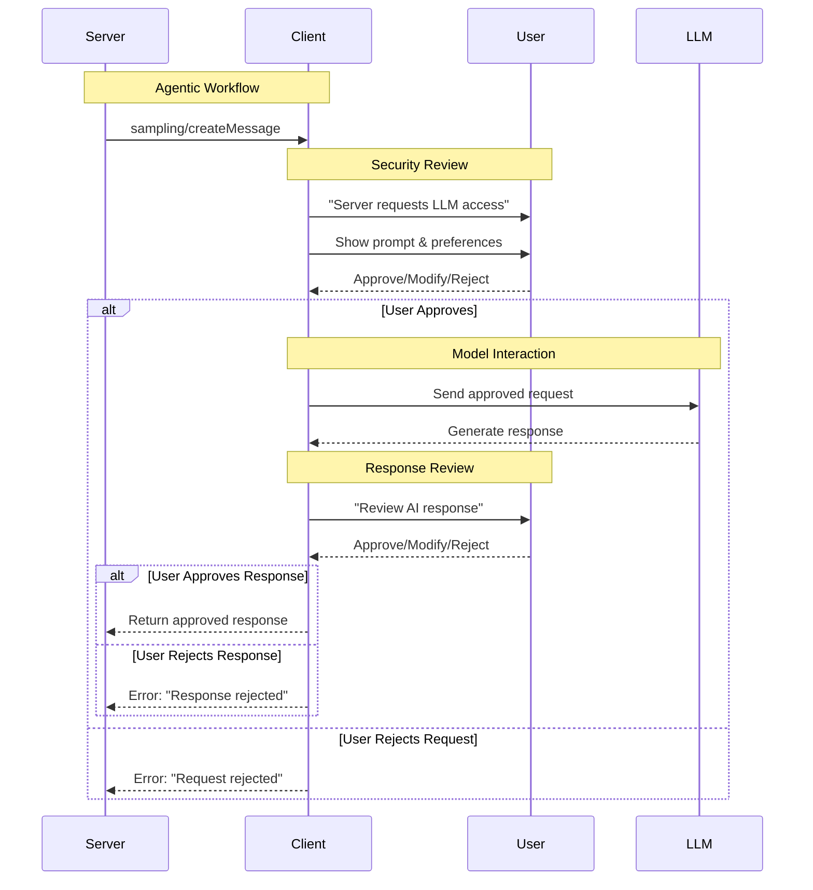

# Sampling Overview

**Protocol Revision**: 2025-06-18

Sampling enables MCP servers to request language model completions from clients, allowing agentic behaviors while maintaining client control over AI access and permissions.

## Core Concepts

### Server-Initiated AI Requests
- Servers request LLM sampling without needing API keys
- Clients maintain control over model selection and access
- Human-in-the-loop validation ensures safety and trust

### Supported Content Types
- **Text**: Standard text-based interactions
- **Image**: Base64-encoded visual content
- **Audio**: Base64-encoded audio data

## Quick Start

### 1. Capability Declaration
```json
{
  "capabilities": {
    "sampling": {}
  }
}
```

### 2. Basic Text Sampling
```json
{
  "jsonrpc": "2.0",
  "id": 1,
  "method": "sampling/createMessage",
  "params": {
    "messages": [
      {
        "role": "user",
        "content": {
          "type": "text",
          "text": "What is the capital of France?"
        }
      }
    ],
    "maxTokens": 100
  }
}
```

### 3. Response Format
```json
{
  "jsonrpc": "2.0",
  "id": 1,
  "result": {
    "role": "assistant",
    "content": {
      "type": "text",
      "text": "The capital of France is Paris."
    },
    "model": "claude-3-sonnet-20240307",
    "stopReason": "endTurn"
  }
}
```

## Advanced Features

### Model Preferences
Intelligent model selection using priorities and hints:

```json
{
  "modelPreferences": {
    "hints": [
      { "name": "claude-3-sonnet" },
      { "name": "claude" }
    ],
    "costPriority": 0.3,
    "speedPriority": 0.8,
    "intelligencePriority": 0.5
  }
}
```

### Multi-Modal Content
```json
{
  "messages": [
    {
      "role": "user",
      "content": {
        "type": "image",
        "data": "base64-encoded-image-data",
        "mimeType": "image/jpeg"
      }
    }
  ]
}
```

### Context Inclusion
```json
{
  "includeContext": "allServers",
  "systemPrompt": "You are a helpful assistant with access to current project context."
}
```

## Message Flow



## Content Types Reference

### Text Content
```typescript
interface TextContent {
  type: "text";
  text: string;
  annotations?: Annotations;
  _meta?: { [key: string]: unknown };
}
```

### Image Content
```typescript
interface ImageContent {
  type: "image";
  data: string;           // Base64-encoded
  mimeType: string;       // e.g., "image/jpeg", "image/png"
  annotations?: Annotations;
  _meta?: { [key: string]: unknown };
}
```

### Audio Content
```typescript
interface AudioContent {
  type: "audio";
  data: string;           // Base64-encoded
  mimeType: string;       // e.g., "audio/wav", "audio/mp3"
  annotations?: Annotations;
  _meta?: { [key: string]: unknown };
}
```

## Model Selection Strategy

### Priority System
Three normalized values (0-1) indicating importance:

```typescript
interface ModelPreferences {
  costPriority?: number;        // 0 = cost unimportant, 1 = minimize cost
  speedPriority?: number;       // 0 = speed unimportant, 1 = maximize speed  
  intelligencePriority?: number; // 0 = capability unimportant, 1 = maximize capability
}
```

### Hint System
Flexible model matching with fallbacks:

```typescript
interface ModelHint {
  name?: string; // Substring matching, e.g., "sonnet", "claude", "gpt-4"
}

// Example: Progressive fallback
{
  "hints": [
    { "name": "claude-3-5-sonnet" },  // Prefer specific model
    { "name": "sonnet" },             // Any Sonnet-class model
    { "name": "claude" }              // Any Claude model
  ]
}
```

### Client Processing
1. **Hint Evaluation**: Process hints in order, find first match
2. **Priority Application**: Use priorities to select among matches
3. **Provider Mapping**: Map to available models (e.g., Claude → Gemini equivalent)
4. **Final Selection**: Client makes final decision based on access and policies

## Use Cases

### 1. Code Analysis
```json
{
  "messages": [
    {
      "role": "user",
      "content": {
        "type": "text",
        "text": "Analyze this code for potential security vulnerabilities:\n\n```python\nuser_input = input()\nexec(user_input)\n```"
      }
    }
  ],
  "modelPreferences": {
    "intelligencePriority": 0.9,
    "speedPriority": 0.3
  },
  "systemPrompt": "You are a security expert. Analyze code for vulnerabilities.",
  "maxTokens": 500
}
```

### 2. Image Description
```json
{
  "messages": [
    {
      "role": "user",
      "content": {
        "type": "image",
        "data": "base64-image-data",
        "mimeType": "image/jpeg"
      }
    },
    {
      "role": "user", 
      "content": {
        "type": "text",
        "text": "Describe what you see in this image"
      }
    }
  ],
  "maxTokens": 200
}
```

### 3. Creative Writing
```json
{
  "messages": [
    {
      "role": "user",
      "content": {
        "type": "text",
        "text": "Write a short story about a robot discovering emotions"
      }
    }
  ],
  "modelPreferences": {
    "intelligencePriority": 0.8,
    "costPriority": 0.2
  },
  "temperature": 0.8,
  "maxTokens": 1000
}
```

## Error Scenarios

### User Rejection
```json
{
  "jsonrpc": "2.0",
  "id": 1,
  "error": {
    "code": -1,
    "message": "User rejected sampling request",
    "data": {
      "reason": "User declined AI interaction"
    }
  }
}
```

### Model Unavailable
```json
{
  "error": {
    "code": -32603,
    "message": "No suitable model available",
    "data": {
      "requestedHints": ["gpt-5"],
      "availableModels": ["claude-3", "gemini-1.5"]
    }
  }
}
```

### Rate Limiting
```json
{
  "error": {
    "code": -32000,
    "message": "Rate limit exceeded",
    "data": {
      "retryAfter": 60,
      "remainingQuota": 0
    }
  }
}
```

## Best Practices

### For Servers
1. **Clear Intent**: Provide descriptive system prompts
2. **Appropriate Limits**: Set reasonable maxTokens values
3. **Graceful Fallbacks**: Handle rejection gracefully
4. **Context Awareness**: Use includeContext appropriately
5. **Model Flexibility**: Provide multiple hint options

### For Clients
1. **User Control**: Always show requests to users
2. **Clear UI**: Make sampling requests easy to understand
3. **Model Selection**: Implement intelligent hint matching
4. **Rate Limiting**: Protect against abuse
5. **Error Feedback**: Provide clear error messages

### Security Considerations
1. **Review Prompts**: Users should see exact prompts being sent
2. **Review Responses**: Users should approve AI responses
3. **Audit Trail**: Log sampling requests for security review
4. **Content Filtering**: Apply appropriate content policies
5. **Access Controls**: Respect organizational AI usage policies

## Implementation Examples

### Client Implementation
```typescript
class SamplingHandler {
  async handleSamplingRequest(request: CreateMessageRequest): Promise<CreateMessageResult> {
    // 1. Present request to user
    const userApproval = await this.showSamplingDialog(request);
    if (!userApproval.approved) {
      throw new Error("User rejected sampling request");
    }
    
    // 2. Select appropriate model
    const model = this.selectModel(request.modelPreferences);
    
    // 3. Send to LLM
    const response = await this.callLLM(model, userApproval.modifiedRequest);
    
    // 4. Show response to user
    const responseApproval = await this.showResponseDialog(response);
    if (!responseApproval.approved) {
      throw new Error("User rejected AI response");
    }
    
    return responseApproval.finalResponse;
  }
}
```

### Server Implementation
```typescript
class AgenticTool {
  async analyzeCode(code: string): Promise<string> {
    try {
      const result = await this.client.request('sampling/createMessage', {
        messages: [{
          role: 'user',
          content: { type: 'text', text: `Analyze: ${code}` }
        }],
        modelPreferences: {
          hints: [{ name: 'claude-3-sonnet' }],
          intelligencePriority: 0.9
        },
        maxTokens: 500
      });
      
      return result.content.text;
    } catch (error) {
      if (error.code === -1) {
        return "Analysis unavailable - user declined AI request";
      }
      throw error;
    }
  }
}
```

## Related Documentation

- [Request Format and Handling](requests.md) - Detailed request/response specifications
- [Security Considerations](security.md) - Comprehensive security guidelines
- [Core Protocol](../../core/) - MCP protocol foundations
- [Transport Layer](../../transport/) - Communication mechanisms