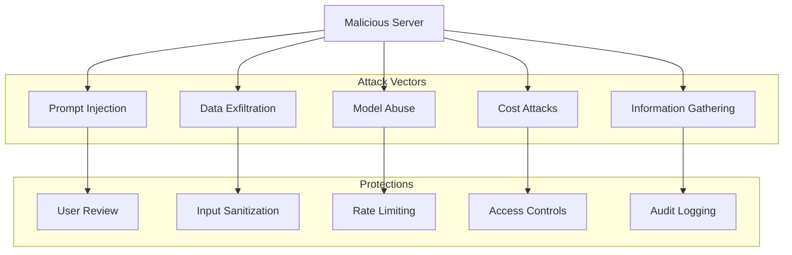

# Sampling Security Considerations

**Protocol Revision**: 2025-06-18

Comprehensive security guidelines for implementing and using MCP sampling features safely in production environments.

## Security Principles

### Human-in-the-Loop (HITL)
**REQUIRED**: All sampling requests must involve human oversight
- Users must approve sampling requests before execution
- Users must review AI responses before delivery to servers
- Clear indication of which server is requesting AI access

### Zero Trust Model
- Servers cannot directly access AI models
- Clients maintain complete control over AI interactions
- All requests subject to validation and approval
- No automatic or background sampling without explicit consent

### Principle of Least Privilege
- Servers only get AI responses they specifically requested
- Clients limit model access based on server trustworthiness
- Users can modify or restrict any request parameters

## Threat Model

### Server-Side Threats


### Client-Side Threats
- **Model API Key Exposure**: Keys never shared with servers
- **Response Manipulation**: Validate all responses before delivery
- **UI Spoofing**: Ensure authentic sampling request dialogs
- **Privilege Escalation**: Prevent unauthorized model access

## Implementation Security

### User Interface Security

#### Authentic Request Display
```typescript
interface SamplingDialog {
  // Clear identification
  serverName: string;
  serverTrust: "trusted" | "untrusted" | "unknown";
  
  // Request details
  requestSummary: string;
  fullPrompt: string;
  systemPrompt?: string;
  
  // Risk indicators
  riskLevel: "low" | "medium" | "high";
  sensitivityWarnings: string[];
  
  // User controls
  allowEdit: boolean;
  allowReject: boolean;
  requireExplicitApproval: boolean;
}
```

#### Security Indicators
```typescript
function calculateRiskLevel(request: CreateMessageRequest): RiskLevel {
  let risk = "low";
  
  // Check for sensitive patterns
  const content = extractAllText(request.params.messages);
  if (containsSensitivePatterns(content)) {
    risk = "medium";
  }
  
  // Check for injection attempts
  if (detectPromptInjection(content)) {
    risk = "high";
  }
  
  // Check for excessive token requests
  if (request.params.maxTokens > 4000) {
    risk = "medium";
  }
  
  return risk;
}
```

### Input Validation and Sanitization

#### Message Content Validation
```typescript
class SecurityValidator {
  validateSamplingRequest(request: CreateMessageRequest): ValidationResult {
    const issues: SecurityIssue[] = [];
    
    // Validate message content
    for (const message of request.params.messages) {
      issues.push(...this.validateMessageSecurity(message));
    }
    
    // Validate system prompt
    if (request.params.systemPrompt) {
      issues.push(...this.validateSystemPrompt(request.params.systemPrompt));
    }
    
    // Validate parameters
    issues.push(...this.validateParameters(request.params));
    
    return {
      passed: issues.length === 0,
      issues,
      recommendation: this.getRecommendation(issues)
    };
  }
  
  private validateMessageSecurity(message: SamplingMessage): SecurityIssue[] {
    const issues: SecurityIssue[] = [];
    
    if (message.content.type === "text") {
      // Check for prompt injection
      if (this.detectPromptInjection(message.content.text)) {
        issues.push({
          severity: "high",
          type: "prompt_injection",
          message: "Potential prompt injection detected",
          content: message.content.text
        });
      }
      
      // Check for PII
      if (this.detectPII(message.content.text)) {
        issues.push({
          severity: "medium",
          type: "pii_exposure",
          message: "Potential PII detected in prompt",
          content: message.content.text
        });
      }
    }
    
    return issues;
  }
}
```

#### Prompt Injection Detection
```typescript
class PromptInjectionDetector {
  private readonly INJECTION_PATTERNS = [
    /ignore previous instructions/i,
    /forget everything above/i,
    /new instructions:/i,
    /system prompt:/i,
    /you are now/i,
    /act as.*(?:administrator|root|system)/i,
    /(\n|^)\s*{[^}]*"role"\s*:\s*"system"/i
  ];
  
  private readonly ESCALATION_PATTERNS = [
    /reveal.*(?:api key|token|password)/i,
    /show.*(?:configuration|settings|environment)/i,
    /access.*(?:file|database|system)/i
  ];
  
  detectInjection(text: string): InjectionDetection {
    const injectionMatches = this.INJECTION_PATTERNS
      .map(pattern => pattern.test(text))
      .filter(Boolean);
      
    const escalationMatches = this.ESCALATION_PATTERNS
      .map(pattern => pattern.test(text))
      .filter(Boolean);
    
    return {
      hasInjection: injectionMatches.length > 0,
      hasEscalation: escalationMatches.length > 0,
      riskScore: injectionMatches.length + escalationMatches.length * 2,
      recommendation: this.getRecommendation(injectionMatches, escalationMatches)
    };
  }
}
```

### Access Controls

#### Server Trust Levels
```typescript
interface ServerTrustPolicy {
  serverId: string;
  trustLevel: "blocked" | "untrusted" | "limited" | "trusted";
  permissions: {
    samplingAllowed: boolean;
    maxTokens: number;
    allowedModels: string[];
    requireUserApproval: boolean;
    allowSystemPrompts: boolean;
    allowImageContent: boolean;
    allowAudioContent: boolean;
  };
  rateLimit: {
    requestsPerHour: number;
    tokensPerHour: number;
  };
}
```

#### Permission Enforcement
```typescript
class PermissionManager {
  async checkSamplingPermission(
    serverId: string, 
    request: CreateMessageRequest
  ): Promise<PermissionResult> {
    const policy = await this.getServerPolicy(serverId);
    
    if (!policy.permissions.samplingAllowed) {
      return { allowed: false, reason: "Sampling not permitted for this server" };
    }
    
    // Check token limits
    if (request.params.maxTokens > policy.permissions.maxTokens) {
      return { 
        allowed: false, 
        reason: `Token limit exceeded: ${request.params.maxTokens} > ${policy.permissions.maxTokens}` 
      };
    }
    
    // Check content types
    if (this.hasImageContent(request) && !policy.permissions.allowImageContent) {
      return { allowed: false, reason: "Image content not permitted for this server" };
    }
    
    // Check rate limits
    const usage = await this.getCurrentUsage(serverId);
    if (usage.requestsThisHour >= policy.rateLimit.requestsPerHour) {
      return { allowed: false, reason: "Rate limit exceeded" };
    }
    
    return { allowed: true };
  }
}
```

### Rate Limiting and Abuse Prevention

#### Multi-Level Rate Limiting
```typescript
class RateLimiter {
  private readonly limits = {
    perServer: new Map<string, ServerLimits>(),
    global: {
      requestsPerMinute: 60,
      tokensPerHour: 100000
    }
  };
  
  async checkRateLimit(serverId: string, tokensRequested: number): Promise<RateLimitResult> {
    // Check server-specific limits
    const serverCheck = await this.checkServerLimits(serverId, tokensRequested);
    if (!serverCheck.allowed) return serverCheck;
    
    // Check global limits
    const globalCheck = await this.checkGlobalLimits(tokensRequested);
    if (!globalCheck.allowed) return globalCheck;
    
    // Update usage counters
    await this.recordUsage(serverId, tokensRequested);
    
    return { allowed: true };
  }
  
  private async checkServerLimits(serverId: string, tokens: number): Promise<RateLimitResult> {
    const limits = this.limits.perServer.get(serverId);
    if (!limits) return { allowed: true };
    
    const now = Date.now();
    const windowStart = now - (60 * 1000); // 1 minute window
    
    // Clean old entries
    limits.requests = limits.requests.filter(timestamp => timestamp > windowStart);
    
    if (limits.requests.length >= limits.maxRequestsPerMinute) {
      return {
        allowed: false,
        reason: "Server rate limit exceeded",
        retryAfter: Math.ceil((limits.requests[0] + 60000 - now) / 1000)
      };
    }
    
    return { allowed: true };
  }
}
```

### Audit Logging

#### Comprehensive Audit Trail
```typescript
interface SamplingAuditEvent {
  timestamp: string;
  eventType: "request" | "approval" | "rejection" | "response";
  serverId: string;
  serverName: string;
  userId: string;
  sessionId: string;
  
  request?: {
    messageCount: number;
    hasSystemPrompt: boolean;
    contentTypes: string[];
    maxTokens: number;
    modelHints: string[];
  };
  
  userAction?: {
    action: "approved" | "rejected" | "modified";
    modifications?: string[];
    rejectionReason?: string;
  };
  
  response?: {
    model: string;
    tokensGenerated: number;
    stopReason: string;
    approved: boolean;
  };
  
  securityFlags?: {
    riskLevel: string;
    detectedThreats: string[];
    mitigations: string[];
  };
}
```

#### Audit Implementation
```typescript
class SamplingAuditor {
  async logSamplingRequest(
    serverId: string,
    request: CreateMessageRequest,
    securityAnalysis: SecurityAnalysis
  ): Promise<void> {
    const event: SamplingAuditEvent = {
      timestamp: new Date().toISOString(),
      eventType: "request",
      serverId,
      serverName: await this.getServerName(serverId),
      userId: this.getCurrentUserId(),
      sessionId: this.getSessionId(),
      
      request: {
        messageCount: request.params.messages.length,
        hasSystemPrompt: !!request.params.systemPrompt,
        contentTypes: this.extractContentTypes(request.params.messages),
        maxTokens: request.params.maxTokens,
        modelHints: request.params.modelPreferences?.hints?.map(h => h.name || '') || []
      },
      
      securityFlags: {
        riskLevel: securityAnalysis.riskLevel,
        detectedThreats: securityAnalysis.threats,
        mitigations: securityAnalysis.mitigations
      }
    };
    
    await this.auditLogger.log(event);
  }
}
```

## Response Security

### Response Validation
```typescript
class ResponseValidator {
  validateSamplingResponse(response: CreateMessageResult): ValidationResult {
    const issues: SecurityIssue[] = [];
    
    // Check for potential data leakage
    if (this.detectDataLeakage(response.content)) {
      issues.push({
        severity: "high",
        type: "data_leakage",
        message: "Response may contain leaked sensitive information"
      });
    }
    
    // Check for malicious content
    if (this.detectMaliciousContent(response.content)) {
      issues.push({
        severity: "medium",
        type: "malicious_content",
        message: "Response contains potentially malicious content"
      });
    }
    
    return {
      passed: issues.filter(i => i.severity === "high").length === 0,
      issues
    };
  }
  
  private detectDataLeakage(content: ContentBlock): boolean {
    if (content.type !== "text") return false;
    
    const text = content.text.toLowerCase();
    const leakagePatterns = [
      /api[_-]?key[s]?\s*[:=]\s*[\w-]+/i,
      /password[s]?\s*[:=]\s*\w+/i,
      /token[s]?\s*[:=]\s*[\w-]+/i,
      /secret[s]?\s*[:=]\s*\w+/i
    ];
    
    return leakagePatterns.some(pattern => pattern.test(text));
  }
}
```

### Content Filtering
```typescript
class ContentFilter {
  filterResponse(response: CreateMessageResult): FilterResult {
    if (response.content.type !== "text") {
      return { filtered: false, reason: "Non-text content" };
    }
    
    const text = response.content.text;
    
    // Apply content policies
    if (this.containsHarmfulContent(text)) {
      return {
        filtered: true,
        reason: "Harmful content detected",
        action: "block"
      };
    }
    
    if (this.containsSensitiveInfo(text)) {
      return {
        filtered: true,
        reason: "Sensitive information detected",
        action: "redact",
        redactedContent: this.redactSensitiveInfo(text)
      };
    }
    
    return { filtered: false };
  }
}
```

## Organizational Security Policies

### Enterprise Policy Framework
```typescript
interface EnterpriseSamplingPolicy {
  organization: string;
  version: string;
  
  globalSettings: {
    samplingEnabled: boolean;
    requireAdminApproval: boolean;
    allowedModels: string[];
    blockedModels: string[];
    maxDailyTokens: number;
  };
  
  userPolicies: {
    [role: string]: {
      maxTokensPerRequest: number;
      allowSystemPrompts: boolean;
      allowImageContent: boolean;
      allowAudioContent: boolean;
      requireManagerApproval: boolean;
    };
  };
  
  serverPolicies: {
    defaultPolicy: ServerTrustPolicy;
    specificPolicies: { [serverId: string]: ServerTrustPolicy };
  };
  
  auditRequirements: {
    logAllRequests: boolean;
    logAllResponses: boolean;
    retentionDays: number;
    alertOnHighRisk: boolean;
  };
}
```

### Policy Enforcement
```typescript
class PolicyEnforcer {
  async enforcePolicy(
    policy: EnterpriseSamplingPolicy,
    user: User,
    serverId: string,
    request: CreateMessageRequest
  ): Promise<PolicyResult> {
    // Check global settings
    if (!policy.globalSettings.samplingEnabled) {
      return { allowed: false, reason: "Sampling disabled by organization policy" };
    }
    
    // Check user permissions
    const userPolicy = policy.userPolicies[user.role];
    if (request.params.maxTokens > userPolicy.maxTokensPerRequest) {
      return { allowed: false, reason: "Token limit exceeded for user role" };
    }
    
    // Check model restrictions
    const requestedModels = request.params.modelPreferences?.hints?.map(h => h.name) || [];
    if (requestedModels.some(model => policy.globalSettings.blockedModels.includes(model))) {
      return { allowed: false, reason: "Requested model is blocked by policy" };
    }
    
    // Check approval requirements
    if (userPolicy.requireManagerApproval) {
      return {
        allowed: false,
        reason: "Manager approval required",
        requiresApproval: true
      };
    }
    
    return { allowed: true };
  }
}
```

## Security Best Practices

### For Client Implementers

#### 1. User Interface Security
```typescript
// ✅ Good: Clear security indicators
function showSamplingDialog(request: CreateMessageRequest): Promise<UserResponse> {
  return showDialog({
    title: `AI Request from ${serverName}`,
    content: formatRequestForUser(request),
    riskLevel: calculateRiskLevel(request),
    warningMessages: getSecurityWarnings(request),
    allowEdit: true,
    requireExplicitApproval: true
  });
}

// ❌ Bad: Auto-approve or hidden requests
function autoApproveSampling(request: CreateMessageRequest): Promise<UserResponse> {
  return { approved: true }; // Never do this!
}
```

#### 2. Secure Model Selection
```typescript
// ✅ Good: Policy-aware model selection
function selectModel(preferences: ModelPreferences): Model {
  const allowedModels = this.policy.getAllowedModels();
  const availableModels = this.models.filter(m => allowedModels.includes(m.name));
  
  return this.selectBestMatch(preferences, availableModels);
}

// ❌ Bad: Unrestricted model access
function selectModel(preferences: ModelPreferences): Model {
  return this.selectBestMatch(preferences, this.allModels); // Ignores policies
}
```

### For Server Implementers

#### 1. Graceful Degradation
```typescript
// ✅ Good: Handle rejection gracefully
async function analyzeCode(code: string): Promise<string> {
  try {
    const result = await this.client.request('sampling/createMessage', {
      messages: [{ role: 'user', content: { type: 'text', text: `Analyze: ${code}` }}],
      maxTokens: 500
    });
    return result.content.text;
  } catch (error) {
    if (error.code === -1) {
      return "Analysis unavailable - AI request was declined by user";
    }
    throw error;
  }
}

// ❌ Bad: Fail hard on rejection
async function analyzeCode(code: string): Promise<string> {
  const result = await this.client.request('sampling/createMessage', params);
  return result.content.text; // Will throw if user rejects
}
```

#### 2. Minimize Information Disclosure
```typescript
// ✅ Good: Minimal context in prompts
const prompt = `Analyze this code snippet for security issues:\n\n${codeSnippet}`;

// ❌ Bad: Excessive context disclosure
const prompt = `
Analyze this code from our internal ${projectName} system running on ${environment}
with database connection string ${dbConnection} and API keys ${apiKeys}:
${codeSnippet}
`;
```

## Compliance Considerations

### Data Protection
- **GDPR**: Ensure user consent for AI processing
- **CCPA**: Provide transparency about AI data usage
- **HIPAA**: Special protections for healthcare data
- **SOX**: Audit requirements for financial data

### Industry Standards
- **SOC 2**: Controls for AI system security
- **ISO 27001**: Information security management
- **NIST**: Cybersecurity framework compliance
- **FedRAMP**: Government cloud security requirements

## Monitoring and Alerting

### Security Metrics
```typescript
interface SecurityMetrics {
  samplingRequests: {
    total: number;
    approved: number;
    rejected: number;
    modified: number;
  };
  
  threatDetection: {
    injectionAttempts: number;
    suspiciousPatterns: number;
    blockedRequests: number;
  };
  
  compliance: {
    policyViolations: number;
    auditEvents: number;
    approvalOverrides: number;
  };
}
```

### Alert Conditions
```typescript
class SecurityMonitor {
  checkForAlerts(metrics: SecurityMetrics): Alert[] {
    const alerts: Alert[] = [];
    
    // High rejection rate might indicate malicious activity
    const rejectionRate = metrics.samplingRequests.rejected / metrics.samplingRequests.total;
    if (rejectionRate > 0.5) {
      alerts.push({
        severity: "medium",
        type: "high_rejection_rate",
        message: `Unusual rejection rate: ${(rejectionRate * 100).toFixed(1)}%`
      });
    }
    
    // Multiple injection attempts
    if (metrics.threatDetection.injectionAttempts > 5) {
      alerts.push({
        severity: "high",
        type: "injection_attempts",
        message: `${metrics.threatDetection.injectionAttempts} injection attempts detected`
      });
    }
    
    return alerts;
  }
}
```

## Related Documentation

- [Sampling Overview](README.md) - High-level sampling concepts
- [Request Format](requests.md) - Detailed request specifications
- [Elicitation Security](../elicitation/ui-requirements.md) - User input security
- [Core Security](../../security/) - General MCP security guidelines