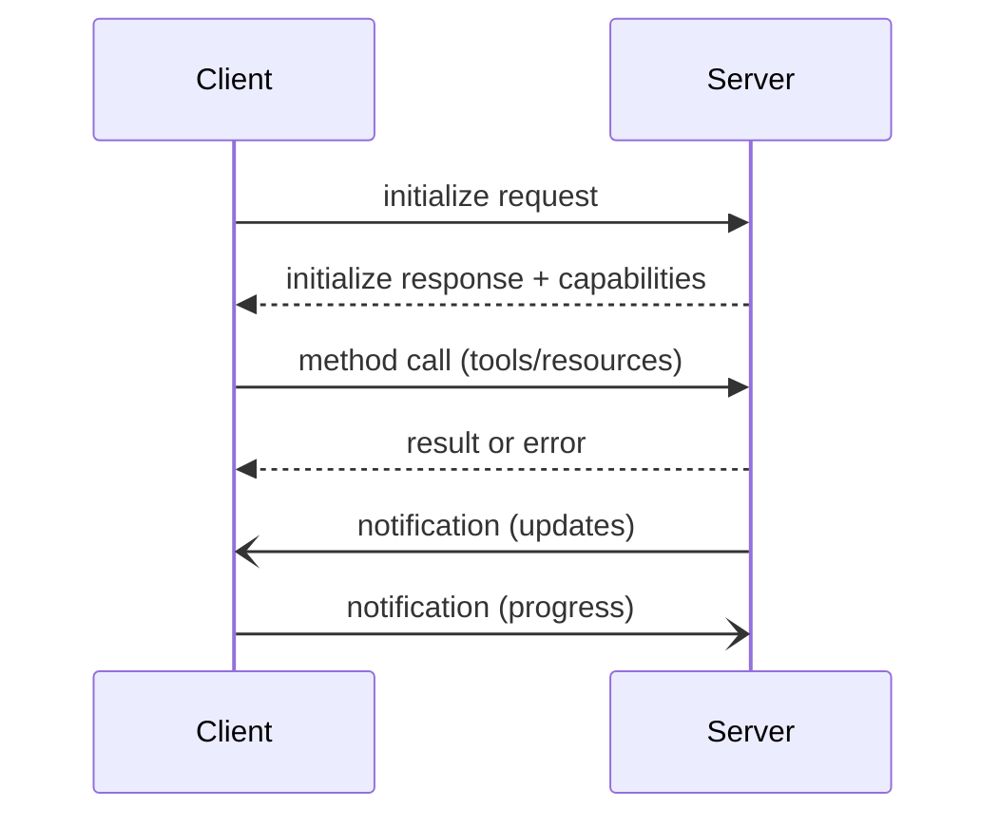

# Core Protocol

The foundation of MCP - essential concepts every implementation needs.

## Overview

MCP is built on **JSON-RPC 2.0** with stateful sessions and capability negotiation. All communication follows request/response patterns with optional notifications.

## Core Components

### 🔤 [Types](./types.md)
Complete TypeScript interface definitions for all protocol messages and data structures.

**Key types:**
- Request/Response/Notification interfaces
- Tool, Resource, Prompt definitions  
- Capability declarations
- Content types (text, image, audio)

### 📨 [Messages](./messages.md)
JSON-RPC message format and communication patterns.

**Covers:**
- Message structure and IDs
- Request/response correlation
- Notification patterns
- The `_meta` field usage

### 🔄 [Lifecycle](./lifecycle.md)
Connection lifecycle from initialization to shutdown.

**Stages:**
1. Transport connection
2. Protocol initialization
3. Capability negotiation
4. Active communication
5. Graceful shutdown

### ❌ [Errors](./errors.md)
Standardized error codes and handling strategies.

**Categories:**
- Protocol errors (-32xxx)
- Application errors
- Transport errors
- Recovery patterns

## Quick Reference

### Message Flow

### Minimum Implementation

1. **Transport**: Choose WebSocket or HTTP
2. **Messages**: Implement JSON-RPC 2.0 format
3. **Lifecycle**: Handle initialize → operate → shutdown
4. **Errors**: Return proper error codes

## Key Principles

- **Stateful Sessions**: Each connection maintains state
- **Capability-Based**: Features must be negotiated
- **Async by Design**: All operations are asynchronous
- **Error Recovery**: Graceful degradation required

## Next Steps

1. Review [Types](./types.md) for data structures
2. Understand [Messages](./messages.md) format
3. Implement [Lifecycle](./lifecycle.md) flow
4. Handle [Errors](./errors.md) properly