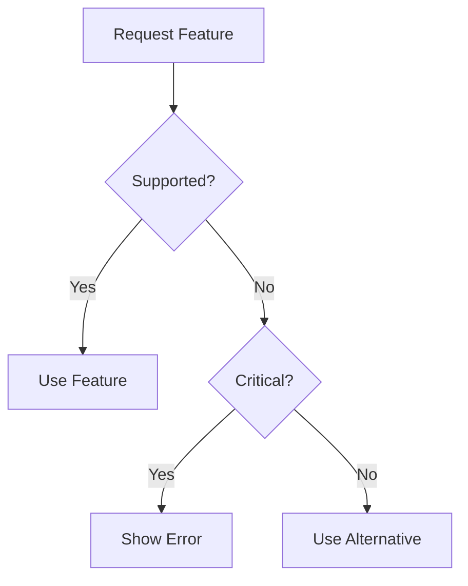

# Error Handling

MCP uses JSON-RPC 2.0 error format with standardized codes and recovery patterns.

## Error Response Format

```typescript
{
  jsonrpc: "2.0",
  id: string | number,    // Matches request ID
  error: {
    code: number,         // Required error code
    message: string,      // Required description
    data?: unknown        // Optional additional info
  }
}
```

## Error Code Ranges

| Range | Usage | Reserved By |
|-------|-------|-------------|
| -32768 to -32000 | Protocol errors | JSON-RPC |
| -32000 to -1 | Implementation-defined | Servers |
| 1 to 32767 | Application errors | Applications |

## Standard JSON-RPC Error Codes

| Code | Name | Description | When to Use |
|------|------|-------------|-------------|
| -32700 | `PARSE_ERROR` | Invalid JSON | Malformed JSON received |
| -32600 | `INVALID_REQUEST` | Invalid request structure | Missing required fields |
| -32601 | `METHOD_NOT_FOUND` | Unknown method | Method name not recognized |
| -32602 | `INVALID_PARAMS` | Invalid parameters | Parameter validation failed |
| -32603 | `INTERNAL_ERROR` | Internal error | Server-side failure |

## Common MCP Error Scenarios

### 1. Protocol Version Mismatch
```json
{
  "jsonrpc": "2.0",
  "id": 1,
  "error": {
    "code": -32602,
    "message": "Unsupported protocol version",
    "data": {
      "supported": ["2025-06-18", "2025-03-26"],
      "requested": "2024-11-05"
    }
  }
}
```
**Recovery:** Disconnect and retry with supported version

### 2. Capability Not Supported
```json
{
  "jsonrpc": "2.0",
  "id": 2,
  "error": {
    "code": -32601,
    "message": "Method not found: sampling/createMessage",
    "data": {
      "reason": "Sampling capability not supported"
    }
  }
}
```
**Recovery:** Check capabilities before using features

### 3. Resource Not Found
```json
{
  "jsonrpc": "2.0",
  "id": 3,
  "error": {
    "code": 404,
    "message": "Resource not found",
    "data": {
      "uri": "file:///missing.txt"
    }
  }
}
```
**Recovery:** List available resources first

### 4. Tool Execution Failed
```json
{
  "jsonrpc": "2.0",
  "id": 4,
  "error": {
    "code": 500,
    "message": "Tool execution failed",
    "data": {
      "tool": "calculator",
      "reason": "Division by zero"
    }
  }
}
```
**Recovery:** Validate inputs before calling

### 5. Authentication Failed
```json
{
  "jsonrpc": "2.0",
  "id": 5,
  "error": {
    "code": 401,
    "message": "Authentication required",
    "data": {
      "authScheme": "bearer"
    }
  }
}
```
**Recovery:** Obtain valid credentials

### 6. Rate Limited
```json
{
  "jsonrpc": "2.0",
  "id": 6,
  "error": {
    "code": 429,
    "message": "Rate limit exceeded",
    "data": {
      "retryAfter": 60,
      "limit": "100/hour"
    }
  }
}
```
**Recovery:** Implement exponential backoff

### 7. Request Timeout
```json
{
  "jsonrpc": "2.0",
  "id": 7,
  "error": {
    "code": 408,
    "message": "Request timeout",
    "data": {
      "timeout": 30000
    }
  }
}
```
**Recovery:** Retry with longer timeout or smaller request

### 8. Invalid Schema
```json
{
  "jsonrpc": "2.0",
  "id": 8,
  "error": {
    "code": -32602,
    "message": "Invalid parameters",
    "data": {
      "schema": {
        "type": "object",
        "required": ["name"]
      },
      "errors": ["Missing required field: name"]
    }
  }
}
```
**Recovery:** Fix request to match schema

## Error Handling Best Practices

### 1. Always Include Context
```json
{
  "code": 404,
  "message": "Tool not found",
  "data": {
    "requested": "translator",
    "available": ["calculator", "formatter", "validator"]
  }
}
```

### 2. Use Appropriate Codes
- JSON-RPC codes for protocol errors
- HTTP-like codes for application errors
- Custom codes for domain-specific errors

### 3. Actionable Messages
Bad: `"Error occurred"`
Good: `"Tool 'translator' not found. Available tools: calculator, formatter"`

### 4. Structured Data
```json
{
  "data": {
    "validationErrors": [
      {
        "field": "arguments.temperature",
        "message": "Must be between 0 and 1",
        "value": 2.5
      }
    ]
  }
}
```

## Recovery Strategies

### Automatic Retry
Suitable for:
- Network errors (with backoff)
- Timeouts (with longer timeout)
- Rate limits (after delay)

### Fallback
Suitable for:
- Missing capabilities
- Unsupported methods
- Resource unavailable

### User Intervention
Required for:
- Authentication failures
- Invalid configuration
- Permission denied

### Graceful Degradation


## Implementation Checklist

- [ ] Use correct error codes
- [ ] Include helpful error data
- [ ] Implement retry logic
- [ ] Handle all standard codes
- [ ] Log errors appropriately
- [ ] Provide recovery hints
- [ ] Validate before sending
- [ ] Test error scenarios