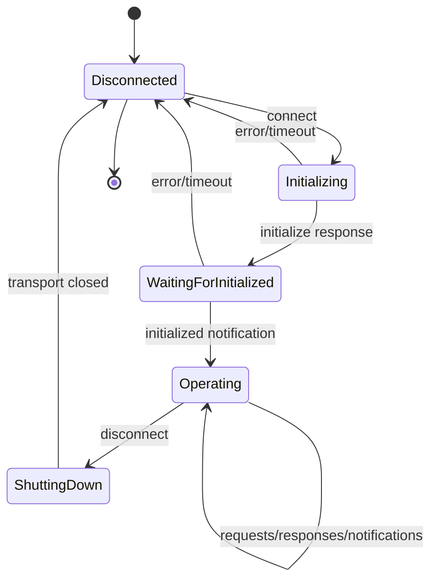
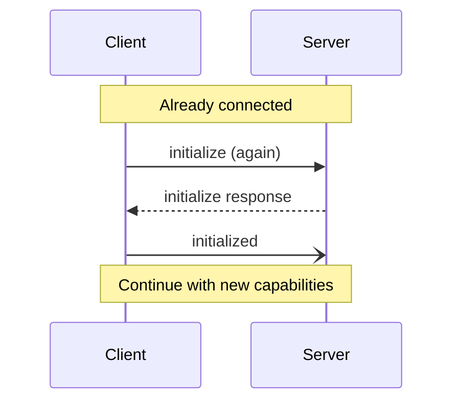
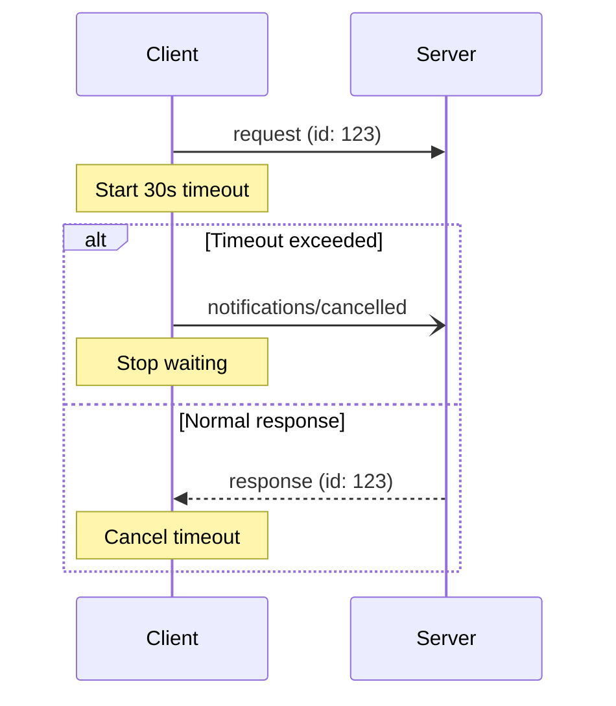

# Protocol Lifecycle

MCP connections follow a strict three-phase lifecycle: **Initialization → Operation → Shutdown**

## State Machine



## Phase 1: Initialization

**MUST** be the first interaction. Establishes protocol version and capabilities.

### Step 1: Client sends `initialize`

```json
{
  "jsonrpc": "2.0",
  "id": 1,
  "method": "initialize",
  "params": {
    "protocolVersion": "2025-06-18",     // Latest supported version
    "capabilities": {
      "roots": { "listChanged": true },   // Optional features
      "sampling": {},
      "elicitation": {}                   // NEW in 2025-06-18
    },
    "clientInfo": {
      "name": "ExampleClient",            // Required
      "title": "Example Client Name",     // Optional display name
      "version": "1.0.0"                  // Required
    }
  }
}
```

### Step 2: Server responds with capabilities

```json
{
  "jsonrpc": "2.0",
  "id": 1,
  "result": {
    "protocolVersion": "2025-06-18",      // Negotiated version
    "capabilities": {
      "logging": {},
      "prompts": { "listChanged": true },
      "resources": { 
        "subscribe": true,
        "listChanged": true 
      },
      "tools": { "listChanged": true }
    },
    "serverInfo": {
      "name": "ExampleServer",            // Required
      "title": "Example Server Name",     // Optional
      "version": "1.0.0"                  // Required
    },
    "instructions": "Optional usage instructions for LLM"
  }
}
```

### Step 3: Client sends `initialized`

```json
{
  "jsonrpc": "2.0",
  "method": "notifications/initialized"
}
```

## Version Negotiation

1. Client sends its **latest** supported version
2. Server responds with:
   - Same version if supported
   - Its latest supported version otherwise
3. Client disconnects if version unsupported

**Example mismatch:**
```json
{
  "jsonrpc": "2.0",
  "id": 1,
  "error": {
    "code": -32602,
    "message": "Unsupported protocol version",
    "data": {
      "supported": ["2025-06-18", "2025-03-26"],
      "requested": "2024-11-05"
    }
  }
}
```

## Capability Reference

### Client Capabilities
| Capability | Sub-capabilities | Description |
|------------|-----------------|-------------|
| `roots` | `listChanged` | Filesystem root discovery |
| `sampling` | - | LLM sampling support |
| `elicitation` | - | User input requests (**NEW**) |
| `experimental` | Custom | Non-standard features |

### Server Capabilities
| Capability | Sub-capabilities | Description |
|------------|-----------------|-------------|
| `prompts` | `listChanged` | Prompt templates |
| `resources` | `subscribe`, `listChanged` | Data resources |
| `tools` | `listChanged` | Executable functions |
| `logging` | - | Structured logs |
| `completions` | - | Argument completion |
| `experimental` | Custom | Non-standard features |

## Phase 2: Operation

Normal message exchange respecting negotiated capabilities.

### Rules
- Client SHOULD NOT send non-ping requests before `initialize` response
- Server SHOULD NOT send non-ping/non-logging requests before `initialized`
- Both MUST respect negotiated capabilities
- Either can send notifications at any time after initialization

### Re-initialization

Clients MAY re-initialize during operation (e.g., after reconnection):



## Phase 3: Shutdown

Clean connection termination varies by transport.

### stdio Transport
1. Client closes stdin to server
2. Wait for server exit
3. Send SIGTERM if needed
4. Send SIGKILL as last resort

### HTTP Transport
- Close HTTP connection(s)
- Session cookies invalidated

### WebSocket Transport
- Send close frame
- Wait for close response
- Close TCP connection

## Timeouts

**Recommendations:**
- Set per-request timeouts
- Send cancellation if timeout exceeded
- MAY reset timeout on progress notifications
- MUST enforce maximum timeout regardless

**Example timeout flow:**


## Error Recovery

### Connection Errors
- Reconnect with new transport connection
- Re-initialize from scratch
- Restore subscriptions if needed

### Protocol Errors
- Invalid initialization → Disconnect
- Capability mismatch → Graceful degradation
- Version mismatch → Disconnect

### State Consistency
- Assume no state preserved across connections
- Re-establish all subscriptions
- Re-query all needed data

## Implementation Checklist

- [ ] Implement three-phase lifecycle
- [ ] Send `initialize` as first message
- [ ] Wait for response before other requests
- [ ] Send `initialized` notification
- [ ] Respect negotiated capabilities
- [ ] Handle version mismatch
- [ ] Implement clean shutdown
- [ ] Set request timeouts
- [ ] Handle re-initialization