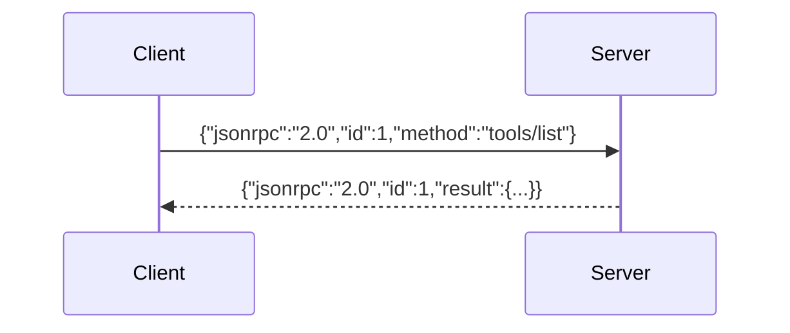
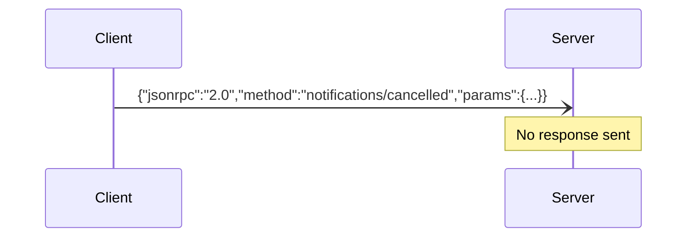
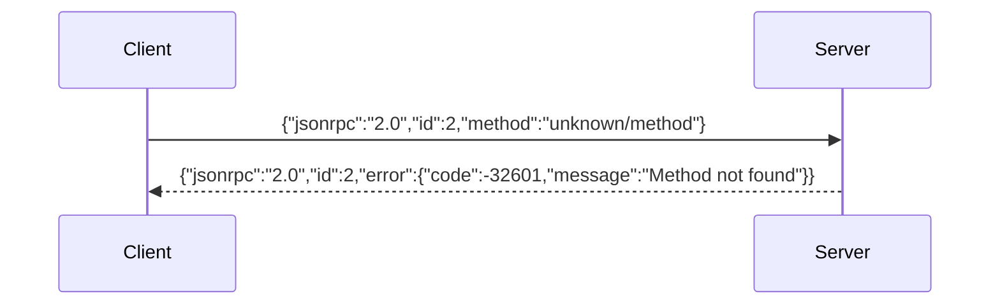
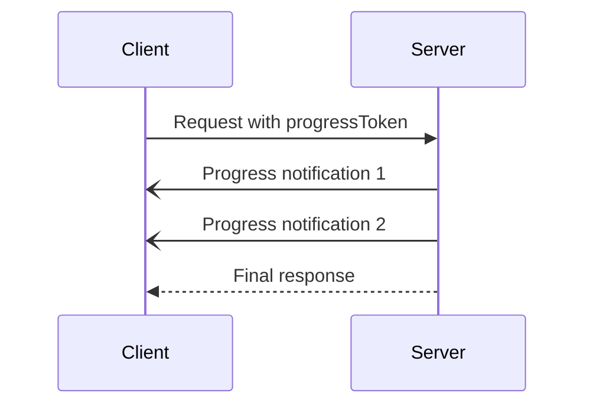

# MCP Message Format

All MCP communication uses **JSON-RPC 2.0** format with specific constraints.

## Message Types

### Request
```typescript
{
  jsonrpc: "2.0",
  id: string | number,      // Required, MUST be unique per session
  method: string,           // Required
  params?: {               // Optional
    _meta?: {              // Optional metadata
      progressToken?: string | number,  // For progress tracking
      [key: string]: unknown
    },
    [key: string]: unknown
  }
}
```

**Constraints:**
- `id` MUST NOT be null (differs from base JSON-RPC)
- `id` MUST NOT be reused within same session
- `method` names follow pattern: `category/operation`

### Response (Success)
```typescript
{
  jsonrpc: "2.0",
  id: string | number,      // MUST match request ID
  result: {                 // Required for success
    _meta?: {              // Optional metadata
      [key: string]: unknown
    },
    [key: string]: unknown
  }
}
```

### Response (Error)
```typescript
{
  jsonrpc: "2.0",
  id: string | number,      // MUST match request ID  
  error: {                  // Required for error
    code: number,           // Required integer
    message: string,        // Required description
    data?: unknown          // Optional additional info
  }
}
```

**Note:** Response MUST have either `result` OR `error`, never both.

### Notification
```typescript
{
  jsonrpc: "2.0",
  method: string,           // Required
  params?: {               // Optional
    _meta?: {              // Optional metadata
      [key: string]: unknown
    },
    [key: string]: unknown
  }
}
```

**Key difference:** Notifications have NO `id` field and expect NO response.

## Error Codes

### Standard JSON-RPC Errors
| Code | Constant | Description |
|------|----------|-------------|
| -32700 | PARSE_ERROR | Invalid JSON |
| -32600 | INVALID_REQUEST | Invalid request structure |
| -32601 | METHOD_NOT_FOUND | Unknown method |
| -32602 | INVALID_PARAMS | Invalid method parameters |
| -32603 | INTERNAL_ERROR | Internal error |

### MCP-Specific Errors
- Application errors: positive integers
- Reserved range: -32768 to -32000 (for JSON-RPC)

## Method Naming

Methods follow `category/operation` pattern:

**Categories:**
- `initialize` - Connection setup
- `ping` - Keepalive
- `tools/*` - Tool operations
- `resources/*` - Resource operations
- `prompts/*` - Prompt operations
- `sampling/*` - LLM sampling
- `elicitation/*` - User input requests
- `roots/*` - Root discovery
- `logging/*` - Logging operations
- `completion/*` - Autocompletion
- `notifications/*` - One-way messages

## The `_meta` Field

Reserved metadata field for protocol extensions.

### Usage Rules
- Available in request `params`, notification `params`, and response `result`
- Protocol reserves certain keys
- Custom keys allowed with restrictions

### Key Format
```
[prefix/]name

prefix: label[.label]*  // Optional, dots separate labels
name: alphanumeric with hyphens, underscores, dots
```

### Reserved Prefixes
- `modelcontextprotocol/*`
- `mcp/*`
- `*.modelcontextprotocol.*/*`
- `*.mcp.*/*`

### Common `_meta` Keys
- `progressToken` - Links progress notifications to requests
- Custom app-specific metadata

## Message Flow Examples

### Request-Response


### Notification


### Error Response


### Progress Tracking


## Implementation Notes

1. **Batching NOT Supported**: MCP 2025-06-18 removed JSON-RPC batch support
2. **ID Generation**: Use incrementing integers or UUIDs
3. **Concurrent Requests**: Multiple requests can be in-flight
4. **Message Size**: Transport-specific limits apply
5. **Encoding**: UTF-8 JSON required

## Common Patterns

### Optional Parameters
```json
{
  "jsonrpc": "2.0",
  "id": 1,
  "method": "resources/read",
  "params": {
    "uri": "file:///example.txt"
  }
}
```

### Empty Result
```json
{
  "jsonrpc": "2.0",
  "id": 1,
  "result": {}
}
```

### Detailed Error
```json
{
  "jsonrpc": "2.0",
  "id": 1,
  "error": {
    "code": 1001,
    "message": "Resource not found",
    "data": {
      "uri": "file:///missing.txt",
      "availableResources": ["file:///exists.txt"]
    }
  }
}
```