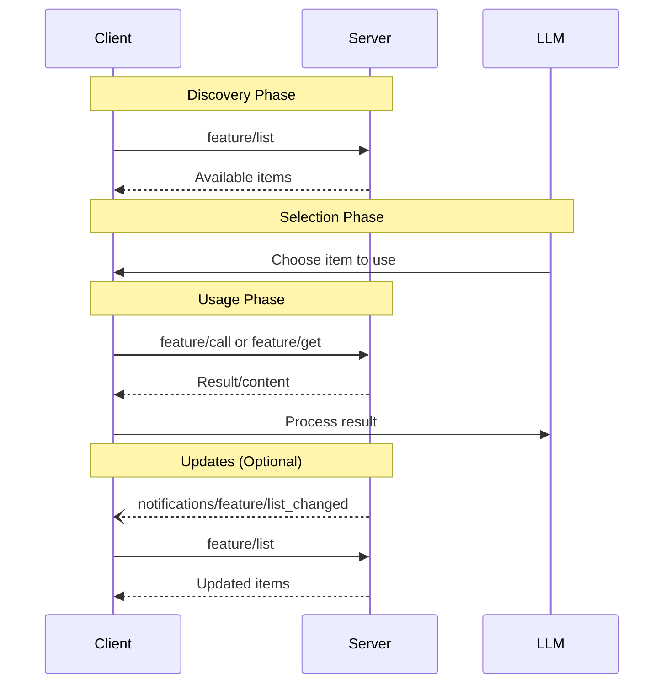

# MCP Server Features - Protocol Version 2025-06-18

MCP servers provide three core capabilities to expose functionality to clients:

## Core Server Features

### 1. Tools
**Model-controlled functions** that LLMs can discover and invoke automatically.

- **Basic Tools**: Function calls with input/output schemas
- **Structured Output**: NEW - JSON schema validation for outputs
- **Resource Links**: NEW - Reference external resources from tool results
- **Annotations**: Behavior hints (read-only, destructive, idempotent)

[📁 Tools Documentation](./tools/)

### 2. Resources
**Data providers** that expose content via URI-based access.

- Resource listing and reading
- URI templates for dynamic resources
- Subscription model for updates
- MIME type support

[📁 Resources Documentation](./resources/)

### 3. Prompts
**Template providers** that generate contextual prompts for LLMs.

- Static and templated prompts
- Argument support
- Message composition

[📁 Prompts Documentation](./prompts/)

## Capability Declaration

Servers declare supported features during initialization:

```typescript
interface ServerCapabilities {
  tools?: {
    listChanged?: boolean;  // Tool list change notifications
  };
  resources?: {
    subscribe?: boolean;    // Resource update subscriptions
    listChanged?: boolean;  // Resource list change notifications
  };
  prompts?: {
    listChanged?: boolean;  // Prompt list change notifications
  };
}
```

## Message Flow Pattern

All server features follow the same discovery → usage pattern:



## NEW Features in 2025-06-18

### Structured Tool Output
Tools can now provide JSON schema for their outputs, enabling strict validation and better type safety.

### Resource Links in Tools
Tools can return links to resources, providing additional context without embedding full content.

### Enhanced Annotations
Improved metadata system for resources, tools, and content blocks with audience targeting and priority hints.

## Security Considerations

All server features must implement:

- Input validation and sanitization
- Access control enforcement  
- Rate limiting
- Output sanitization
- Audit logging

Clients should always maintain human oversight for:
- Tool invocations
- Resource access
- Prompt generation