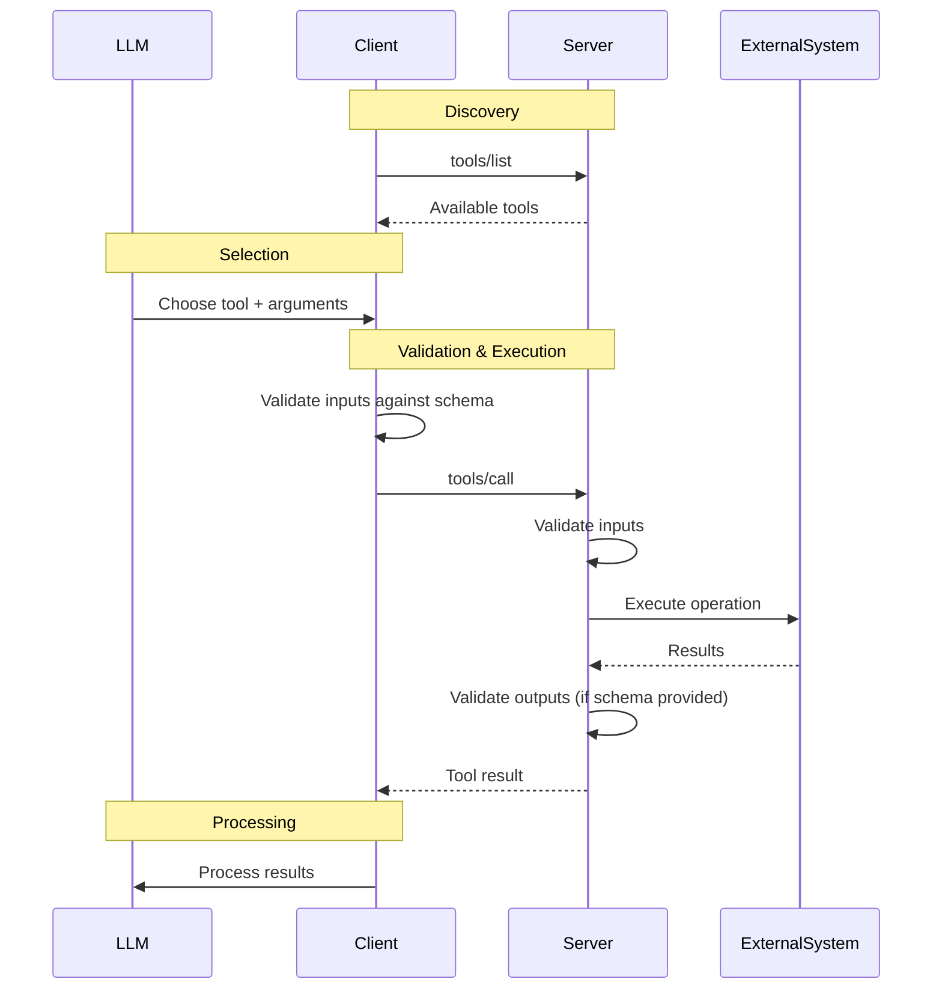

# MCP Tools Overview

Tools are **model-controlled functions** that enable LLMs to interact with external systems through defined interfaces. Tools provide structured inputs/outputs with JSON schema validation.

## Core Concepts

### Tool Definition
```typescript
interface Tool {
  name: string;                    // Unique identifier
  title?: string;                  // Human-readable display name
  description?: string;            // Functionality description
  inputSchema: JSONSchema;         // Required input validation
  outputSchema?: JSONSchema;       // NEW - Optional output validation
  annotations?: ToolAnnotations;   // Behavior hints
}
```

### Tool Execution Flow


## Protocol Messages

### Discovery: `tools/list`
```json
{
  "jsonrpc": "2.0", "id": 1, "method": "tools/list",
  "params": { "cursor": "optional-pagination" }
}
```

Response:
```json
{
  "jsonrpc": "2.0", "id": 1,
  "result": {
    "tools": [
      {
        "name": "get_weather",
        "title": "Weather Information Provider", 
        "description": "Get current weather for a location",
        "inputSchema": {
          "type": "object",
          "properties": {
            "location": { "type": "string", "description": "City name" }
          },
          "required": ["location"]
        }
      }
    ],
    "nextCursor": "next-page-token"
  }
}
```

### Invocation: `tools/call`
```json
{
  "jsonrpc": "2.0", "id": 2, "method": "tools/call",
  "params": {
    "name": "get_weather",
    "arguments": { "location": "New York" }
  }
}
```

Response:
```json
{
  "jsonrpc": "2.0", "id": 2,
  "result": {
    "content": [
      {
        "type": "text",
        "text": "Temperature: 72°F, Conditions: Partly cloudy"
      }
    ],
    "isError": false
  }
}
```

## Content Types in Tool Results

### Text Content
```json
{
  "type": "text",
  "text": "Tool result text",
  "annotations": {
    "audience": ["user"],
    "priority": 0.8
  }
}
```

### Image Content
```json
{
  "type": "image", 
  "data": "base64-encoded-image",
  "mimeType": "image/png"
}
```

### Audio Content
```json
{
  "type": "audio",
  "data": "base64-encoded-audio", 
  "mimeType": "audio/wav"
}
```

### Resource Links (NEW)
```json
{
  "type": "resource_link",
  "uri": "file:///project/src/main.rs",
  "name": "main.rs",
  "description": "Primary application entry point",
  "mimeType": "text/x-rust"
}
```

### Embedded Resources
```json
{
  "type": "resource",
  "resource": {
    "uri": "file:///project/config.json",
    "title": "Configuration File",
    "mimeType": "application/json",
    "text": "{\"key\": \"value\"}"
  }
}
```

## Tool Annotations

Behavior hints for clients:

```typescript
interface ToolAnnotations {
  title?: string;              // Display name override
  readOnlyHint?: boolean;      // Does not modify environment
  destructiveHint?: boolean;   // May perform destructive updates
  idempotentHint?: boolean;    // Same args = same effect
  openWorldHint?: boolean;     // Interacts with external entities
}
```

Example:
```json
{
  "name": "delete_file",
  "annotations": {
    "title": "Delete File",
    "readOnlyHint": false,
    "destructiveHint": true,
    "idempotentHint": false,
    "openWorldHint": false
  }
}
```

## Error Handling

### Protocol Errors (Unknown tool, invalid args)
```json
{
  "jsonrpc": "2.0", "id": 3,
  "error": {
    "code": -32602,
    "message": "Unknown tool: invalid_tool_name"
  }
}
```

### Tool Execution Errors (Business logic failures)
```json
{
  "jsonrpc": "2.0", "id": 4,
  "result": {
    "content": [
      {
        "type": "text", 
        "text": "API rate limit exceeded"
      }
    ],
    "isError": true
  }
}
```

## Security Requirements

### Server MUST:
- Validate all tool inputs against schema
- Implement access controls per tool
- Rate limit tool invocations
- Sanitize all outputs
- Log tool usage for auditing

### Client SHOULD:
- Show tool inputs before execution
- Prompt for user confirmation on sensitive operations
- Validate tool results before passing to LLM
- Implement request timeouts
- Maintain audit logs

## Files in this Directory

- **[basics.md](./basics.md)** - Tool registration and execution patterns
- **[structured-output.md](./structured-output.md)** - NEW structured output with JSON schema
- **[resource-links.md](./resource-links.md)** - NEW resource linking in tool results