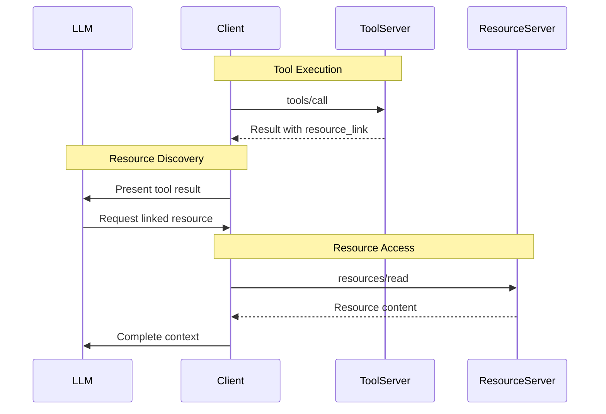

# NEW: Resource Links in Tool Results

**Protocol Version**: 2025-06-18  
**Feature Status**: NEW - Added in this revision

Resource links enable tools to reference external resources without embedding full content, providing efficient context sharing and lazy loading capabilities.

## Core Concepts

### Resource Link Structure
```typescript
interface ResourceLink {
  type: "resource_link";
  uri: string;                    // Resource URI
  name?: string;                  // Display name
  description?: string;           // Human-readable description
  mimeType?: string;              // Content type hint
  annotations?: Annotations;      // Audience and priority hints
}
```

### Usage in Tool Results


## Basic Resource Link Usage

### File System References
```typescript
async function executeCodeAnalysisTool(args: any): Promise<CallToolResult> {
  const { projectPath, analysisType } = args;
  
  try {
    const analysisResults = await analyzeCodebase(projectPath, analysisType);
    
    return {
      content: [
        {
          type: "text",
          text: `Code analysis complete. Found ${analysisResults.issues.length} issues across ${analysisResults.fileCount} files.`,
          annotations: {
            audience: ["user"],
            priority: 0.9
          }
        }
      ],
      structuredContent: {
        summary: analysisResults.summary,
        issueCount: analysisResults.issues.length,
        fileCount: analysisResults.fileCount
      },
      // Link to detailed results
      content: [
        {
          type: "text",
          text: `Code analysis complete. Found ${analysisResults.issues.length} issues.`
        },
        {
          type: "resource_link",
          uri: `file://${analysisResults.reportPath}`,
          name: "analysis_report.json",
          description: "Detailed code analysis report with issue locations and recommendations",
          mimeType: "application/json",
          annotations: {
            audience: ["assistant"],
            priority: 0.8
          }
        },
        {
          type: "resource_link", 
          uri: `file://${analysisResults.configPath}`,
          name: "analysis_config.yaml",
          description: "Analysis configuration used for this run",
          mimeType: "application/yaml",
          annotations: {
            audience: ["assistant"],
            priority: 0.5
          }
        }
      ],
      isError: false
    };
    
  } catch (error) {
    return {
      content: [
        {
          type: "text",
          text: `Code analysis failed: ${error.message}`
        }
      ],
      isError: true
    };
  }
}
```

### Database Query Results
```typescript
async function executeDatabaseQueryTool(args: any): Promise<CallToolResult> {
  const { query, database, exportFormat } = args;
  
  try {
    const results = await executeQuery(query, database);
    
    // Export large result sets to files
    const exportPath = await exportResults(results, exportFormat);
    
    return {
      content: [
        {
          type: "text",
          text: `Query executed successfully. Returned ${results.length} rows.`
        },
        {
          type: "resource_link",
          uri: `file://${exportPath}`,
          name: `query_results.${exportFormat}`,
          description: `Query results exported in ${exportFormat} format`,
          mimeType: getMimeType(exportFormat),
          annotations: {
            audience: ["user", "assistant"],
            priority: 0.9
          }
        }
      ],
      structuredContent: {
        rowCount: results.length,
        columnCount: results[0] ? Object.keys(results[0]).length : 0,
        executionTime: results.executionTime,
        exportPath: exportPath
      },
      isError: false
    };
    
  } catch (error) {
    return {
      content: [
        {
          type: "text",
          text: `Database query failed: ${error.message}`
        }
      ],
      isError: true
    };
  }
}
```

## Advanced Patterns

### Multiple Resource Types
```typescript
async function executeDocumentationTool(args: any): Promise<CallToolResult> {
  const { projectPath, includeExamples } = args;
  
  try {
    const docs = await generateDocumentation(projectPath, includeExamples);
    
    const content: ContentBlock[] = [
      {
        type: "text",
        text: `Documentation generated for ${docs.moduleCount} modules.`
      }
    ];
    
    // Main documentation
    content.push({
      type: "resource_link",
      uri: `file://${docs.mainDocPath}`,
      name: "README.md", 
      description: "Primary project documentation",
      mimeType: "text/markdown",
      annotations: {
        audience: ["user"],
        priority: 1.0
      }
    });
    
    // API Reference
    content.push({
      type: "resource_link",
      uri: `file://${docs.apiDocPath}`,
      name: "api_reference.html",
      description: "Generated API documentation with interactive examples",
      mimeType: "text/html",
      annotations: {
        audience: ["assistant"],
        priority: 0.8
      }
    });
    
    // Configuration files
    if (docs.configFiles.length > 0) {
      docs.configFiles.forEach(configFile => {
        content.push({
          type: "resource_link",
          uri: `file://${configFile.path}`,
          name: configFile.name,
          description: `${configFile.type} configuration file`,
          mimeType: configFile.mimeType,
          annotations: {
            audience: ["assistant"],
            priority: 0.6
          }
        });
      });
    }
    
    // Example code (if requested)
    if (includeExamples && docs.examples.length > 0) {
      docs.examples.forEach(example => {
        content.push({
          type: "resource_link",
          uri: `file://${example.path}`,
          name: example.name,
          description: `Example: ${example.description}`,
          mimeType: getLanguageMimeType(example.language),
          annotations: {
            audience: ["assistant"],
            priority: 0.7
          }
        });
      });
    }
    
    return { content, isError: false };
    
  } catch (error) {
    return {
      content: [
        {
          type: "text",
          text: `Documentation generation failed: ${error.message}`
        }
      ],
      isError: true
    };
  }
}
```

### Dynamic Resource Generation
```typescript
async function executeReportGeneratorTool(args: any): Promise<CallToolResult> {
  const { dataSource, reportType, timeRange } = args;
  
  try {
    // Generate multiple report formats
    const reportGenerator = new ReportGenerator(dataSource);
    const reports = await reportGenerator.generateMultiFormat(reportType, timeRange);
    
    const content: ContentBlock[] = [
      {
        type: "text",
        text: `Generated ${reportType} report for ${timeRange}. Available in multiple formats.`
      }
    ];
    
    // Add links to each generated format
    for (const [format, report] of Object.entries(reports)) {
      content.push({
        type: "resource_link",
        uri: report.uri,
        name: `${reportType}_report.${format}`,
        description: `${reportType} report in ${format.toUpperCase()} format`,
        mimeType: getFormatMimeType(format),
        annotations: {
          audience: format === 'pdf' ? ["user"] : ["user", "assistant"],
          priority: format === 'json' ? 0.9 : 0.7,
          lastModified: new Date().toISOString()
        }
      });
    }
    
    // Link to raw data if available
    if (reports.rawData) {
      content.push({
        type: "resource_link",
        uri: reports.rawData.uri,
        name: "raw_data.csv",
        description: "Source data used for report generation",
        mimeType: "text/csv",
        annotations: {
          audience: ["assistant"],
          priority: 0.5
        }
      });
    }
    
    return {
      content,
      structuredContent: {
        reportType,
        timeRange,
        formats: Object.keys(reports),
        dataPoints: reports.summary?.dataPoints || 0,
        generatedAt: new Date().toISOString()
      },
      isError: false
    };
    
  } catch (error) {
    return {
      content: [
        {
          type: "text",
          text: `Report generation failed: ${error.message}`
        }
      ],
      isError: true
    };
  }
}
```

## Client-Side Resource Handling

### Automatic Resource Resolution
```typescript
class ResourceLinkResolver {
  private mcpClient: MCPClient;
  private cache: Map<string, any> = new Map();
  
  constructor(mcpClient: MCPClient) {
    this.mcpClient = mcpClient;
  }
  
  async resolveResourceLinks(toolResult: CallToolResult): Promise<ResolvedToolResult> {
    const resolvedContent: ContentBlock[] = [];
    
    for (const content of toolResult.content) {
      if (content.type === 'resource_link') {
        const resourceLink = content as ResourceLink;
        
        // Check cache first
        if (this.cache.has(resourceLink.uri)) {
          resolvedContent.push({
            type: "resource",
            resource: this.cache.get(resourceLink.uri)
          });
          continue;
        }
        
        try {
          // Fetch resource content
          const resource = await this.mcpClient.readResource(resourceLink.uri);
          this.cache.set(resourceLink.uri, resource);
          
          resolvedContent.push({
            type: "resource",
            resource: resource,
            annotations: resourceLink.annotations
          });
          
        } catch (error) {
          // Keep original link if resolution fails
          resolvedContent.push({
            ...content,
            annotations: {
              ...resourceLink.annotations,
              resolutionError: error.message
            }
          });
        }
      } else {
        resolvedContent.push(content);
      }
    }
    
    return {
      ...toolResult,
      content: resolvedContent
    };
  }
}
```

### Selective Resource Loading
```typescript
class SmartResourceResolver {
  async resolveBasedOnAudience(
    toolResult: CallToolResult,
    audience: Role
  ): Promise<CallToolResult> {
    
    const resolvedContent: ContentBlock[] = [];
    
    for (const content of toolResult.content) {
      if (content.type === 'resource_link') {
        const resourceLink = content as ResourceLink;
        
        // Check if resource is relevant for current audience
        const annotations = resourceLink.annotations;
        if (annotations?.audience && !annotations.audience.includes(audience)) {
          // Skip resource not intended for this audience
          continue;
        }
        
        // Check priority threshold
        if (annotations?.priority && annotations.priority < 0.7) {
          // Keep as link for low-priority resources
          resolvedContent.push(content);
          continue;
        }
        
        // Resolve high-priority resources
        try {
          const resource = await this.fetchResource(resourceLink.uri);
          resolvedContent.push({
            type: "resource",
            resource: resource,
            annotations: resourceLink.annotations
          });
        } catch (error) {
          resolvedContent.push(content); // Keep original link on error
        }
        
      } else {
        resolvedContent.push(content);
      }
    }
    
    return { ...toolResult, content: resolvedContent };
  }
}
```

## Resource Link Patterns

### Temporary Resources
```typescript
async function executeImageProcessingTool(args: any): Promise<CallToolResult> {
  const { imageUrl, operations } = args;
  
  try {
    const processor = new ImageProcessor();
    const processedImages = await processor.apply(imageUrl, operations);
    
    // Create temporary files for processed images
    const tempLinks = await Promise.all(
      processedImages.map(async (image, index) => {
        const tempPath = await createTempFile(image.data, 'png');
        
        return {
          type: "resource_link" as const,
          uri: `file://${tempPath}`,
          name: `processed_image_${index + 1}.png`,
          description: `Image after ${image.operation} operation`,
          mimeType: "image/png",
          annotations: {
            audience: ["user"] as Role[],
            priority: 0.8,
            temporary: true,  // Custom annotation
            expiresAt: new Date(Date.now() + 3600000).toISOString() // 1 hour
          }
        };
      })
    );
    
    return {
      content: [
        {
          type: "text",
          text: `Applied ${operations.length} operations to image. Results available as temporary files.`
        },
        ...tempLinks
      ],
      isError: false
    };
    
  } catch (error) {
    return {
      content: [
        {
          type: "text",
          text: `Image processing failed: ${error.message}`
        }
      ],
      isError: true
    };
  }
}
```

### Cross-Server Resources
```typescript
async function executeDataIntegrationTool(args: any): Promise<CallToolResult> {
  const { sources, outputFormat } = args;
  
  try {
    const integrator = new DataIntegrator();
    const result = await integrator.combine(sources);
    
    return {
      content: [
        {
          type: "text",
          text: `Integrated data from ${sources.length} sources. Combined ${result.totalRecords} records.`
        },
        // Link to result on current server
        {
          type: "resource_link",
          uri: `integration://result/${result.id}`,
          name: "integrated_data.json",
          description: "Combined dataset from all sources",
          mimeType: "application/json",
          annotations: {
            audience: ["assistant"],
            priority: 0.9
          }
        },
        // Links to source data on other servers (if accessible)
        ...sources.map(source => ({
          type: "resource_link" as const,
          uri: source.uri,
          name: source.name,
          description: `Source data: ${source.description}`,
          mimeType: source.mimeType,
          annotations: {
            audience: ["assistant"] as Role[],
            priority: 0.6,
            sourceServer: source.serverInfo
          }
        }))
      ],
      structuredContent: {
        resultId: result.id,
        sourceCount: sources.length,
        totalRecords: result.totalRecords,
        schema: result.schema
      },
      isError: false
    };
    
  } catch (error) {
    return {
      content: [
        {
          type: "text",
          text: `Data integration failed: ${error.message}`
        }
      ],
      isError: true
    };
  }
}
```

## Benefits and Use Cases

### Performance Benefits
- **Lazy Loading**: Resources loaded only when needed
- **Bandwidth Efficiency**: Avoid large embedded content
- **Caching**: Resources can be cached and reused
- **Parallel Processing**: Multiple resources can be fetched concurrently

### Use Cases
- **Large Data Sets**: Link to CSV/JSON files instead of embedding
- **Generated Reports**: Reference multi-format outputs
- **Documentation**: Link to comprehensive docs and examples
- **Media Files**: Reference images, audio, video without base64 encoding
- **Configuration Files**: Point to related config and setup files
- **Source Code**: Reference implementation files and examples

### Client Benefits
- **Selective Loading**: Load only relevant resources
- **User Control**: Let users choose which resources to access
- **Progressive Enhancement**: Start with summaries, dive into details
- **Resource Management**: Track and organize linked resources

## Best Practices

### 1. Meaningful Descriptions
```typescript
// Good: Descriptive and actionable
{
  type: "resource_link",
  uri: "file:///reports/security_audit_2024.pdf",
  name: "security_audit_2024.pdf",
  description: "Comprehensive security audit report with 23 critical findings and remediation steps"
}

// Bad: Generic and unhelpful
{
  type: "resource_link", 
  uri: "file:///reports/file1.pdf",
  name: "file1.pdf",
  description: "PDF file"
}
```

### 2. Appropriate Audience Targeting
```typescript
// Technical details for assistants
{
  type: "resource_link",
  uri: "file:///config/nginx.conf",
  annotations: {
    audience: ["assistant"],
    priority: 0.8
  }
}

// User-friendly reports for users
{
  type: "resource_link",
  uri: "file:///reports/summary.html", 
  annotations: {
    audience: ["user"],
    priority: 0.9
  }
}
```

### 3. Resource Lifecycle Management
```typescript
// Temporary resources with expiration
{
  type: "resource_link",
  annotations: {
    temporary: true,
    expiresAt: "2024-06-18T15:30:00Z",
    cleanupPolicy: "automatic"
  }
}
```