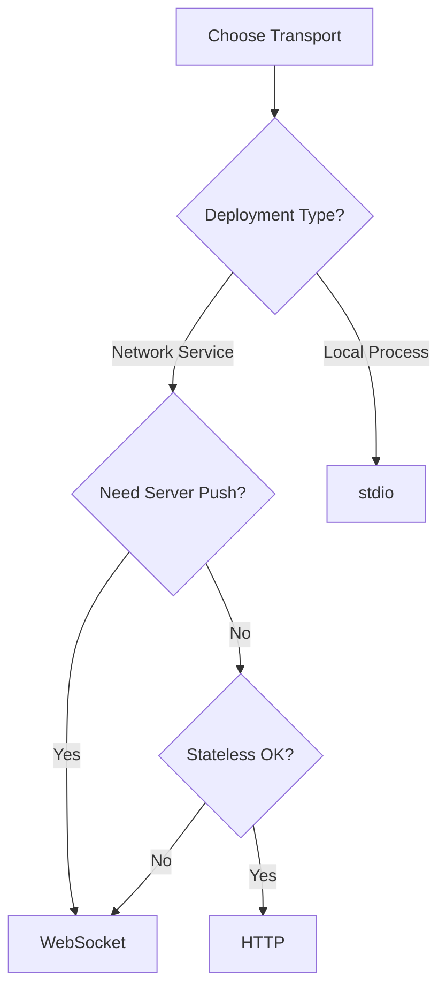
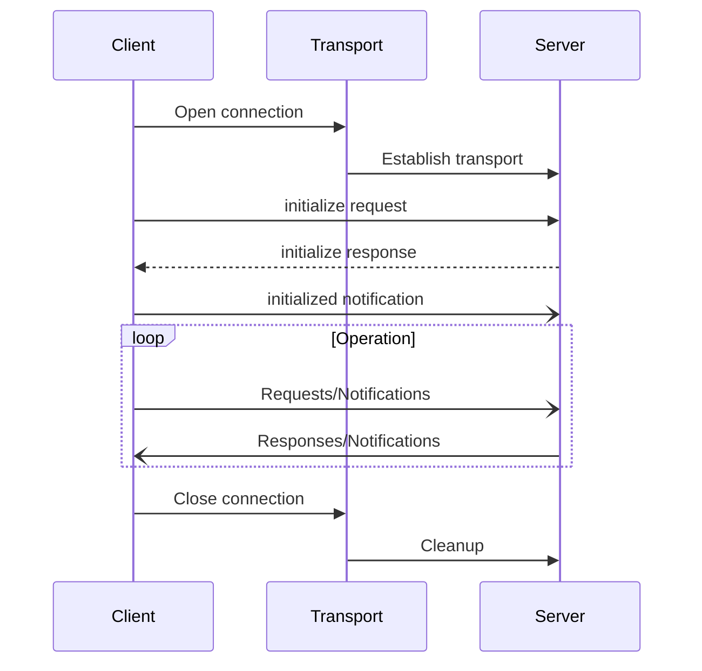

# Transport Layer

MCP supports multiple transport mechanisms for different deployment scenarios.

## Transport Comparison

| Feature | WebSocket | HTTP | stdio |
|---------|-----------|------|-------|
| **Connection Type** | Persistent | Request/Response | Persistent |
| **Bidirectional** | ✓ Full duplex | ✗ Client-initiated | ✓ Full duplex |
| **State Management** | Per connection | Session cookies | Per process |
| **Deployment** | Network services | Web APIs | Local processes |
| **Authentication** | Headers/Params | OAuth/Headers | Environment |
| **Use Case** | Real-time apps | REST-like APIs | CLI tools |

## Transport Selection Guide



## Available Transports

### 🔌 [WebSocket](./websocket.md)
Full-duplex communication over TCP
- Real-time bidirectional messages
- Server-initiated notifications
- Long-lived connections
- Binary and text frames

### 🌐 [HTTP](./http.md)  
Request/response over HTTP/HTTPS
- RESTful API style
- Session management via cookies
- Chunked encoding for progress
- Standard web infrastructure

### 📝 stdio (Standard I/O)
Process communication via stdin/stdout
- Local tool integration
- CLI applications
- Zero network overhead
- Process isolation

## Protocol Requirements

All transports MUST:
- Carry JSON-RPC 2.0 messages
- Preserve message ordering
- Handle message boundaries
- Support concurrent requests
- Implement proper shutdown

## Message Framing

### WebSocket
- Text frames for JSON-RPC
- One message per frame
- No additional framing needed

### HTTP
- One message per request body
- Response in response body
- Content-Type: `application/json`

### stdio
- Line-delimited JSON
- One message per line
- Newline (`\n`) as delimiter

## Connection Lifecycle



## Security Considerations

### Network Transports (WebSocket/HTTP)
- Use TLS (wss://, https://)
- Implement authentication
- Validate origins (CORS)
- Rate limiting recommended

### Local Transport (stdio)
- Process isolation
- Environment-based auth
- Filesystem permissions
- No network exposure

## Implementation Notes

### Error Handling
- Transport errors vs protocol errors
- Connection retry strategies
- Graceful degradation
- Timeout management

### Performance
- Message size limits vary
- Batching not supported
- Connection pooling (HTTP)
- Keep-alive strategies

### Compatibility
- HTTP/1.1 minimum
- WebSocket RFC 6455
- UTF-8 encoding required
- JSON-RPC 2.0 strict

## Quick Start Examples

### WebSocket Client
```typescript
const ws = new WebSocket('wss://server.example/mcp');
ws.send(JSON.stringify({
  jsonrpc: "2.0",
  id: 1,
  method: "initialize",
  params: { /* ... */ }
}));
```

### HTTP Client
```typescript
fetch('https://server.example/mcp', {
  method: 'POST',
  headers: {
    'Content-Type': 'application/json',
    'MCP-Protocol-Version': '2025-06-18'
  },
  body: JSON.stringify({
    jsonrpc: "2.0",
    id: 1,
    method: "initialize",
    params: { /* ... */ }
  })
});
```

### stdio Client
```bash
echo '{"jsonrpc":"2.0","id":1,"method":"initialize","params":{}}' | mcp-server
```

## Next Steps

1. Choose transport based on requirements
2. Review transport-specific details
3. Implement connection management
4. Add authentication as needed
5. Handle transport errors gracefully