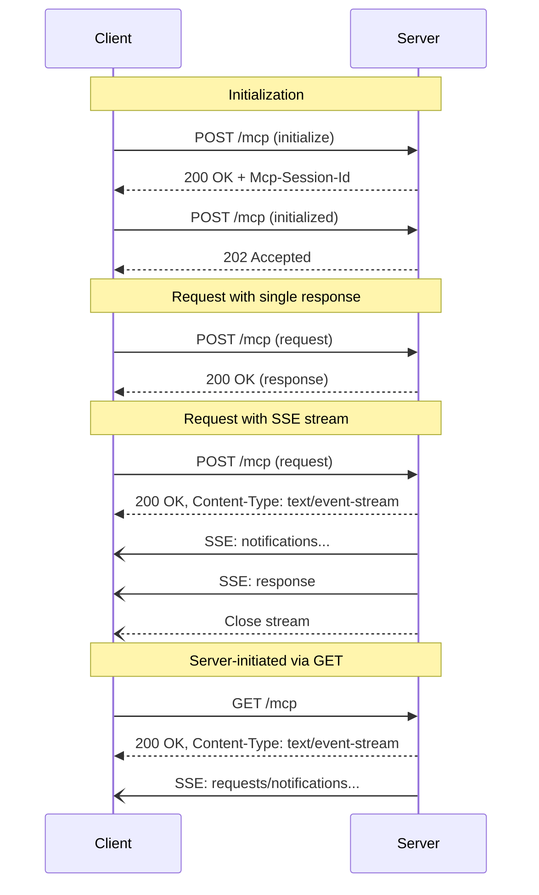
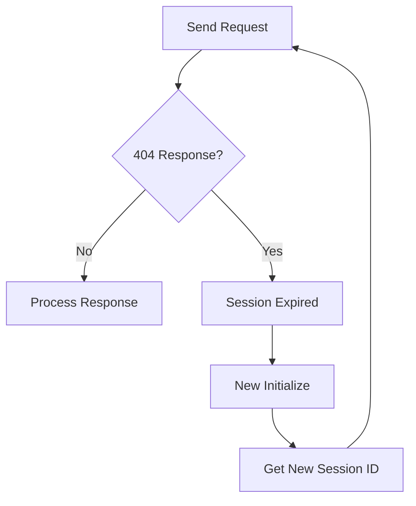

# HTTP Transport (Streamable HTTP)

Request/response transport with optional Server-Sent Events (SSE) for streaming.

## Overview

HTTP transport enables MCP over standard web infrastructure:
- Stateless request/response model
- Optional SSE for server-initiated messages
- Session management via headers
- Compatible with proxies, load balancers

## Transport Flow



## Request Format

### Headers (Client → Server)
```http
POST /mcp HTTP/1.1
Host: server.example.com
Content-Type: application/json
Accept: application/json, text/event-stream
MCP-Protocol-Version: 2025-06-18
Mcp-Session-Id: 1868a90c-7a7b-4545-ad16-4bec7e8a8b24
Content-Length: 123
```

### Body
Single JSON-RPC message per request:
```json
{
  "jsonrpc": "2.0",
  "id": 1,
  "method": "tools/list",
  "params": {}
}
```

## Response Types

### 1. Simple JSON Response
For requests expecting single response:
```http
HTTP/1.1 200 OK
Content-Type: application/json
Content-Length: 456

{
  "jsonrpc": "2.0",
  "id": 1,
  "result": {
    "tools": [...]
  }
}
```

### 2. SSE Stream Response
For requests that may generate multiple messages:
```http
HTTP/1.1 200 OK
Content-Type: text/event-stream
Cache-Control: no-cache
Connection: keep-alive

data: {"jsonrpc":"2.0","method":"notifications/progress","params":{...}}

data: {"jsonrpc":"2.0","id":1,"result":{...}}

```

### 3. Notification/Response Acknowledgment
For notifications or responses (no return value):
```http
HTTP/1.1 202 Accepted
Content-Length: 0
```

## Session Management

### Session Creation
Server returns session ID during initialization:
```http
HTTP/1.1 200 OK
Mcp-Session-Id: 1868a90c-7a7b-4545-ad16-4bec7e8a8b24
Content-Type: application/json

{
  "jsonrpc": "2.0",
  "id": 1,
  "result": {
    "protocolVersion": "2025-06-18",
    "capabilities": {...}
  }
}
```

### Session Usage
Client MUST include session ID in all subsequent requests:
```http
POST /mcp HTTP/1.1
Mcp-Session-Id: 1868a90c-7a7b-4545-ad16-4bec7e8a8b24
```

### Session Termination
```http
DELETE /mcp HTTP/1.1
Mcp-Session-Id: 1868a90c-7a7b-4545-ad16-4bec7e8a8b24
```

### Session Expiry Handling


## Server-Sent Events (SSE)

### SSE Format
```
event: message
data: {"jsonrpc":"2.0","method":"logging/message","params":{...}}
id: 123

event: message  
data: {"jsonrpc":"2.0","id":1,"result":{...}}
id: 124

```

### Event Types
- Default (`message`): JSON-RPC messages
- Custom events not used in MCP

### Resumable Streams
Support connection recovery:
```http
GET /mcp HTTP/1.1
Last-Event-ID: 123
Mcp-Session-Id: 1868a90c-7a7b-4545-ad16-4bec7e8a8b24
```

Server replays events after ID 123.

## Security Requirements

### 1. Origin Validation
```typescript
// Server MUST validate Origin header
if (!isAllowedOrigin(request.headers.origin)) {
  return response.status(403).send('Forbidden');
}
```

### 2. Local Binding
```typescript
// Bind to localhost only for local servers
server.listen(port, '127.0.0.1');
```

### 3. Authentication
Options include:
- Bearer tokens in Authorization header
- API keys in custom headers
- OAuth 2.0 flows
- Session-based auth

## Protocol Version Header

**NEW in 2025-06-18**: Required header for version negotiation

```http
MCP-Protocol-Version: 2025-06-18
```

Rules:
- Client MUST send on all requests after initialization
- Should match negotiated version
- Missing header → assume 2025-03-26 (backwards compatibility)
- Invalid version → 400 Bad Request

## Status Codes

| Code | Meaning | Usage |
|------|---------|-------|
| 200 | OK | Successful response |
| 202 | Accepted | Notification/response acknowledged |
| 400 | Bad Request | Invalid request/version |
| 401 | Unauthorized | Authentication required |
| 403 | Forbidden | Access denied |
| 404 | Not Found | Session expired or invalid endpoint |
| 405 | Method Not Allowed | Endpoint doesn't support method |
| 429 | Too Many Requests | Rate limited |
| 500 | Internal Server Error | Server error |

## Implementation Example

### Client
```typescript
class MCPHTTPClient {
  private sessionId?: string;
  private protocolVersion = "2025-06-18";
  
  async request(method: string, params?: any): Promise<any> {
    const headers: any = {
      'Content-Type': 'application/json',
      'Accept': 'application/json, text/event-stream',
      'MCP-Protocol-Version': this.protocolVersion
    };
    
    if (this.sessionId) {
      headers['Mcp-Session-Id'] = this.sessionId;
    }
    
    const response = await fetch(this.endpoint, {
      method: 'POST',
      headers,
      body: JSON.stringify({
        jsonrpc: "2.0",
        id: this.nextId++,
        method,
        params
      })
    });
    
    if (response.status === 404 && this.sessionId) {
      // Session expired, reinitialize
      this.sessionId = undefined;
      await this.initialize();
      return this.request(method, params);
    }
    
    if (response.headers.get('content-type')?.includes('event-stream')) {
      return this.handleSSE(response);
    }
    
    return response.json();
  }
  
  private async handleSSE(response: Response) {
    const reader = response.body.getReader();
    const decoder = new TextDecoder();
    let buffer = '';
    
    while (true) {
      const { done, value } = await reader.read();
      if (done) break;
      
      buffer += decoder.decode(value, { stream: true });
      const lines = buffer.split('\n');
      buffer = lines.pop() || '';
      
      for (const line of lines) {
        if (line.startsWith('data: ')) {
          const data = JSON.parse(line.slice(6));
          if ('id' in data && data.id === this.currentRequestId) {
            return data;
          }
          // Handle other messages (notifications, etc)
        }
      }
    }
  }
}
```

## Chunked Encoding

When progress tracking is used:
```http
HTTP/1.1 200 OK
Transfer-Encoding: chunked
Content-Type: text/event-stream

6B
data: {"jsonrpc":"2.0","method":"notifications/progress","params":{"progressToken":"abc"}}

4A  
data: {"jsonrpc":"2.0","id":1,"result":{"status":"complete"}}

0
```

## Best Practices

1. **Use HTTPS** in production
2. **Implement session recovery** for resilience  
3. **Set reasonable timeouts** (30s recommended)
4. **Handle rate limiting** with exponential backoff
5. **Validate Origin header** for CORS security
6. **Support compression** (gzip/deflate)
7. **Log session lifecycle** for debugging
8. **Monitor SSE connections** to prevent leaks

## Backwards Compatibility

Supporting old HTTP+SSE transport (pre-2025-06-18):

```typescript
async function detectTransport(url: string): Promise<'new' | 'old'> {
  try {
    // Try new transport
    const response = await fetch(url, {
      method: 'POST',
      headers: { 'Accept': 'application/json, text/event-stream' },
      body: JSON.stringify({ /* initialize */ })
    });
    
    if (response.ok) return 'new';
  } catch (e) {
    // Fall through
  }
  
  // Try old transport
  const response = await fetch(url, { method: 'GET' });
  if (response.ok && response.headers.get('content-type')?.includes('event-stream')) {
    return 'old';
  }
  
  throw new Error('No compatible transport found');
}
```