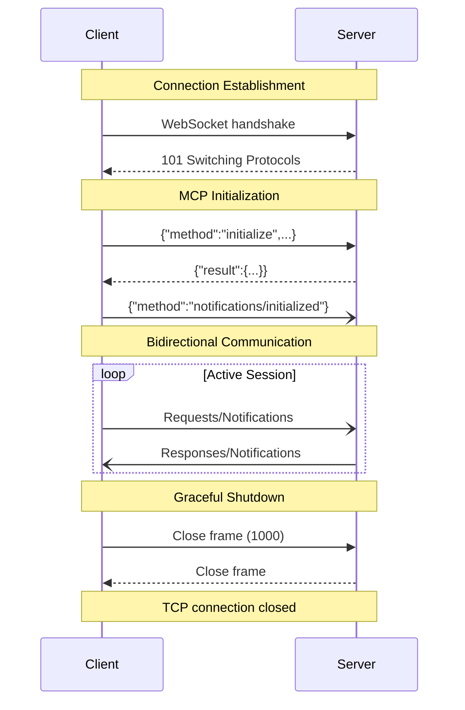
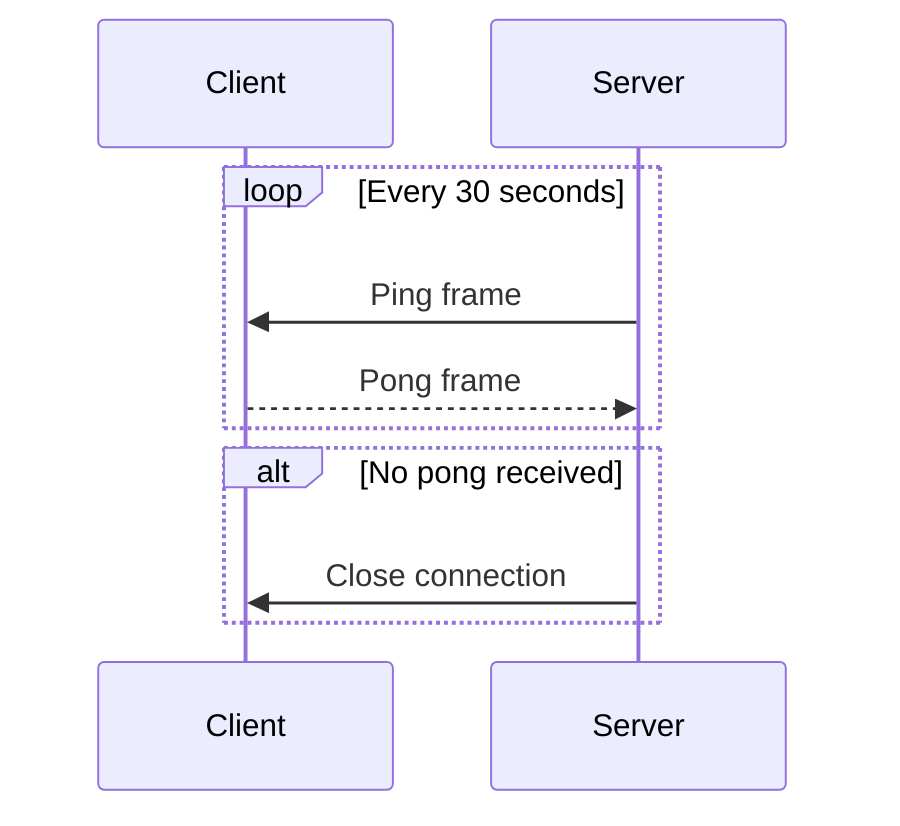

# WebSocket Transport

Full-duplex communication channel for real-time MCP interactions.

## Overview

WebSocket provides persistent, bidirectional communication ideal for:
- Server-initiated requests and notifications
- Real-time resource updates
- Low-latency tool execution
- Streaming responses

## Connection Flow



## Connection Establishment

### Client Handshake
```http
GET /mcp HTTP/1.1
Host: server.example.com
Upgrade: websocket
Connection: Upgrade
Sec-WebSocket-Key: dGhlIHNhbXBsZSBub25jZQ==
Sec-WebSocket-Version: 13
Sec-WebSocket-Protocol: mcp
Origin: https://client.example.com
```

### Server Response
```http
HTTP/1.1 101 Switching Protocols
Upgrade: websocket
Connection: Upgrade
Sec-WebSocket-Accept: s3pPLMBiTxaQ9kYGzzhZRbK+xOo=
Sec-WebSocket-Protocol: mcp
```

## Message Format

### Text Frames Only
- All MCP messages MUST use text frames (opcode 0x1)
- Binary frames (opcode 0x2) MUST NOT be used
- Each frame contains exactly one JSON-RPC message

### Message Boundaries
```
Frame 1: {"jsonrpc":"2.0","id":1,"method":"tools/list"}
Frame 2: {"jsonrpc":"2.0","id":1,"result":{"tools":[...]}}
Frame 3: {"jsonrpc":"2.0","method":"notifications/progress","params":{...}}
```

## Implementation Requirements

### Frame Handling
```typescript
// Sending messages
ws.send(JSON.stringify({
  jsonrpc: "2.0",
  id: requestId,
  method: "resources/read",
  params: { uri: "file:///example.txt" }
}));

// Receiving messages
ws.on('message', (data) => {
  const message = JSON.parse(data.toString());
  // Handle based on message type
});
```

### Ping/Pong Frames
- Servers SHOULD send ping frames (opcode 0x9)
- Clients MUST respond with pong frames (opcode 0xA)
- Use for connection health monitoring

### Connection Keep-Alive


## Error Handling

### Connection Errors
| Event | Action |
|-------|--------|
| Connection failed | Retry with exponential backoff |
| Connection dropped | Re-establish and re-initialize |
| Invalid frame | Close with code 1002 |
| Protocol error | Close with code 1002 |

### Close Codes
| Code | Meaning | Action |
|------|---------|--------|
| 1000 | Normal closure | Clean shutdown |
| 1001 | Going away | Server shutting down |
| 1002 | Protocol error | Fix implementation |
| 1006 | Abnormal closure | Network failure |
| 1008 | Policy violation | Check authentication |
| 1011 | Internal error | Server error |

## Security

### TLS Required
```typescript
// Always use wss:// for production
const ws = new WebSocket('wss://server.example.com/mcp');
```

### Authentication Options
1. **URL Parameters**
   ```
   wss://server.example.com/mcp?token=abc123
   ```

2. **Headers (during handshake)**
   ```
   Authorization: Bearer abc123
   ```

3. **First Message**
   ```json
   {
     "jsonrpc": "2.0",
     "method": "authenticate",
     "params": { "token": "abc123" }
   }
   ```

### Origin Validation
Servers MUST validate the `Origin` header to prevent CSRF attacks.

## State Management

### Per-Connection State
- Each WebSocket connection maintains separate MCP session
- State not shared between connections
- Re-initialize after reconnection

### Reconnection Strategy
```typescript
class MCPWebSocketClient {
  private reconnectDelay = 1000;
  private maxReconnectDelay = 30000;
  
  async connect() {
    try {
      this.ws = new WebSocket(this.url);
      await this.initialize();
      this.reconnectDelay = 1000; // Reset on success
    } catch (error) {
      await this.sleep(this.reconnectDelay);
      this.reconnectDelay = Math.min(
        this.reconnectDelay * 2,
        this.maxReconnectDelay
      );
      this.connect(); // Retry
    }
  }
}
```

## Performance Considerations

### Message Size
- No inherent size limit in WebSocket
- Recommended max: 1MB per message
- Use pagination for large results

### Compression
- Per-message deflate extension supported
- Negotiate during handshake
- Reduces bandwidth ~60-80%

### Concurrency
- Multiple requests can be in-flight
- Use unique IDs for correlation
- No head-of-line blocking

## Example Implementation

### Minimal Client
```typescript
class MCPWebSocketTransport {
  private ws: WebSocket;
  private handlers = new Map();
  private nextId = 1;
  
  async connect(url: string) {
    return new Promise((resolve, reject) => {
      this.ws = new WebSocket(url);
      
      this.ws.on('open', () => {
        this.initialize().then(resolve).catch(reject);
      });
      
      this.ws.on('message', (data) => {
        const msg = JSON.parse(data.toString());
        if ('id' in msg && this.handlers.has(msg.id)) {
          const handler = this.handlers.get(msg.id);
          this.handlers.delete(msg.id);
          if ('error' in msg) {
            handler.reject(msg.error);
          } else {
            handler.resolve(msg.result);
          }
        }
      });
      
      this.ws.on('error', reject);
    });
  }
  
  async request(method: string, params?: any) {
    const id = this.nextId++;
    return new Promise((resolve, reject) => {
      this.handlers.set(id, { resolve, reject });
      this.ws.send(JSON.stringify({
        jsonrpc: "2.0",
        id,
        method,
        params
      }));
    });
  }
}
```

## Best Practices

1. **Always** use TLS in production
2. **Implement** reconnection logic
3. **Handle** all close codes appropriately
4. **Validate** message format before parsing
5. **Set** reasonable timeouts on requests
6. **Monitor** connection health with ping/pong
7. **Limit** concurrent requests to prevent overload
8. **Log** connection events for debugging